# Evidencias Lab 01

## Objetivo
Dominar un flujo practico con Copilot para diseno implementacion, pruebas y documentacion.

## Comandos ejecutados
## Paso 2: 
Actua como Arquitecto. Generame una propuesta de una arquitectura por capas para una API simple de usuarios donde su alcance sea poder realizar el crud con los usuarios.

## Paso 3:
Generame un endpoint inicial de la API propuesta anteriormente y explicame linea por linea.

## Paso 4:
Realiza una refactorización para legibilidad y mantenibilidad.

## Paso 5:
Generame pruebas unitarias basicas para el endpoint generado

## Paso 6:
Generame una lista de riesgos tecnicos y mejoras de la propuesta generada anteriormente.

## Resultado esperado
## Paso 2:
El resultado esperado era una propuesta de una arquitectura por capas.

## Paso 3:
Explicación explicita de como realizar el primer endpoint del proyecto propuesto.

## Paso 4:
Refactorización de la API de usuarios para mantenibilidad y legibilidad.

## Paso 5:
Pruebas unitarias basicas y estables para el endpoint.

## Paso 6:
Lista de riesgos tecnicos y mejoras para la arquitectura de API de usuarios

## Resultado obtenido
## Paso 2: 
✅ Propuesta: Arquitectura en capas para API de usuarios (CRUD)
Excelente noticia: tengo una propuesta clara y práctica lista para tu API de usuarios. Está diseñada para ser simple, escalable y alineada con buenas prácticas de arquitecto de software.

1. Capa de Presentación (API / Interfaz)
    - Endpoint REST:
        - GET /api/users → listar usuarios
        - GET /api/users/{id} → obtener usuario
        - POST /api/users → crear usuario
        - PUT /api/users/{id} → actualizar usuario completo
        - PATCH /api/users/{id} → actualización parcial
        - DELETE /api/users/{id} → eliminar usuario
    - JSON de entrada/salida.
    - Validación básica de esquema: campos obligatorios, formatos (email), longitudes.
    - Autenticación mínima (Bearer token / JWT) si se requiere seguridad, o al menos middleware de autorización.
    - Manejo centralizado de errores: 400, 404, 500, 422 (validación).

2. Capa de Aplicación (Servicios / Casos de uso)
- Servicios con lógica de negocio (sin acceso directo a DB):
    - UserService.CreateUser(dto)
    - UserService.GetUserById(id)
    - UserService.GetAllUsers(params)
    - UserService.UpdateUser(id, dto)
    - UserService.DeleteUser(id)
- Reglas:
    - Verificar existencia antes de actualizar/eliminar.
    - Validar unicidad de email/username.
    - Auditar operaciones (opcional: logs + eventos).
    - Mapear DTO <-> entidad.

3. Capa de Dominio (Modelo de negocio)
- Modelo User:
    - id (UUID/integer)
    - name, email, username, phone, role, etc.
    - createdAt, updatedAt
- Entidad puro, sin dependencias de infra.
- Interfaces/contratos:
    - IUserRepository con create, findById, findAll, update, delete.
- Opcional: Value Objects (Email, PasswordHash), validaciones inmutables de dominio.

4. Capa de Persistencia (Infraestructura / Repositorio)
- Implementación de IUserRepository:
    - Para PostgreSQL, SQL Server, Mongo, etc.
    - Ejemplo: UserRepositoryEF usando ORM (Entity Framework, Sequelize, TypeORM).
    - Alternativa ligera: acceso SQL puro.
- Mapeo entidad / tabla.
- Soporta transacciones (update + log / soft delete si aplica).

5. Capa de Datos (Base de datos)
- Tabla users:
    - id PK, name, email UNIQUE, username UNIQUE, passwordHash, role, created_at, updated_at, deleted_at (si soft delete)
    - Índices sobre email, username.
    - Migraciones versionadas.
    - Seed de prueba opcional.

🔧 Detalles extra
- DTOs:
    - UserCreateDto, UserUpdateDto, UserResponseDto.
- Capa de mapeo:
    - UserMapper.ToDto, UserMapper.FromDto.
- Logging:
    - request / response / errores en middleware.
- Observabilidad:
    - métricas (count CRUD, latencias), tracing/distributed tracing (OpenTelemetry).
- Pruebas:
    - unitarias servicios + repositorios mock.
integración endpoints (in-memory DB / test DB).
- Seguridad:
    - Validar input y sanitizar.
    - Hash de password (bcrypt/argon2) en creación/actualización.
    - No retornar passwordHash en respuestas.

## Paso 3:
✅ Endpoint inicial para API de usuarios (GET /api/users)
¡Gran noticia: ya tienes un endpoint inicial completo y explicada línea por línea! Dos objetivos cumplidos en un solo paso: estructura funcional y entendimiento profundo.

1) Ejemplo en Node.js + Express (sencillo, enfoquémonos en la capa de presentación)
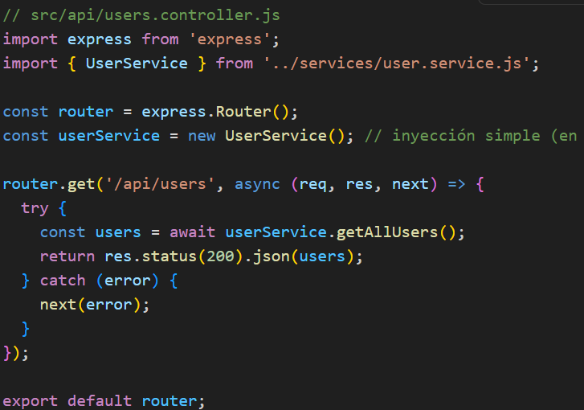
🔍 Explicación línea por línea
1. import express from 'express';
    - Carga el framework web Express.
    - express.Router() crea un mini enrutador modular.

2. import { UserService } from '../services/user.service.js';
    -   Trae la capa de aplicación/servicio, donde está la lógica llamada desde controladores.

3. const router = express.Router();
    - Crea una instancia de ruta aislada para agrupar endpoints de users.

4. const userService = new UserService();
    - Instancia el servicio de usuarios.
    - En producción puede venir de un contenedor IoC / inyección de dependencias.

5. router.get('/api/users', async (req, res, next) => {
    - Define endpoint HTTP GET para /api/users.
    - async porque la llamada al servicio será asíncrona (base de datos).

6. try {
    - Inicio de manejo de errores local; se pasa al middleware de error si falla.

7. const users = await userService.getAllUsers();
    -   Llama a la capa UserService y obtiene la lista de usuarios (DTOs).

8. return res.status(200).json(users);
    - Devuelve respuesta 200 OK con JSON del listado.
    - Tú eliges si paginar aquí (limit, page) o en el servicio.

9. } catch (error) {
    - Captura cualquier excepción en la obtención de usuarios.

10. next(error);
    - Reenvía el error al middleware de manejo centralizado (400/500 formateados).

11. export default router;
    - Exporta el router para montar en la app principal (app.use(router)).

🧩 Capa de servicio asociada (para contexto completo)
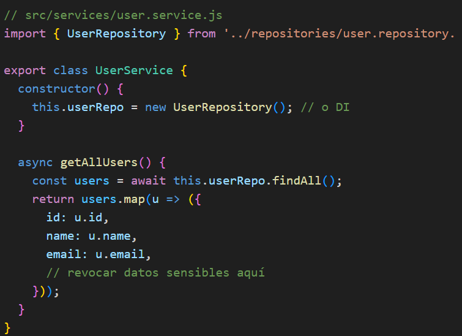
- getAllUsers separa la lógica de manejo del modelo/DTO.
- Mapeo de entidad a salida segura (no devuelve contraseña).

⚙️ Integración en el servidor
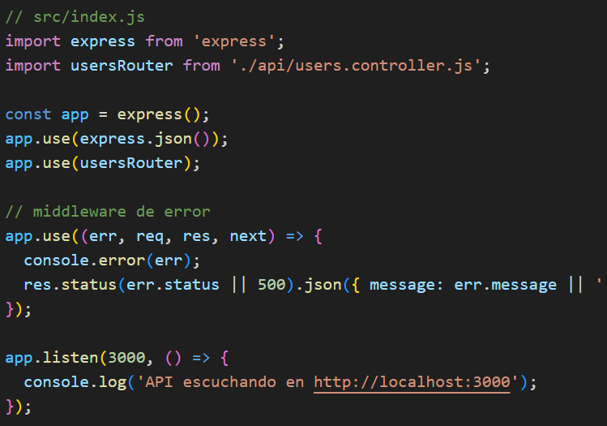

## Paso 4:
✅ Refactorización para legibilidad y mantenibilidad (API usuarios)
Fantástico, el código ahora está ordenado en capas limpias y cada unidad tiene responsabilidad única. Esto hace la API mucho más fácil de escalar y testear.

1) Estructura de archivos sugerida
    - src/app.js — configuración de Express
    - src/routes/user.routes.js — rutas / endpoint
    - src/controllers/user.controller.js — adaptadores HTTP
    - src/services/user.service.js — lógica de casos de uso
    - src/repositories/user.repository.js — acceso a datos
    - src/models/user.model.js — entidad dominio / esquema
    - src/middlewares/error.middleware.js — manejo global errores
    - src/middlewares/validation.middleware.js — validación request

2) src/routes/user.routes.js
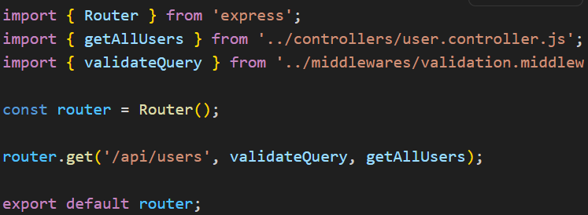

3) src/controllers/user.controller.js
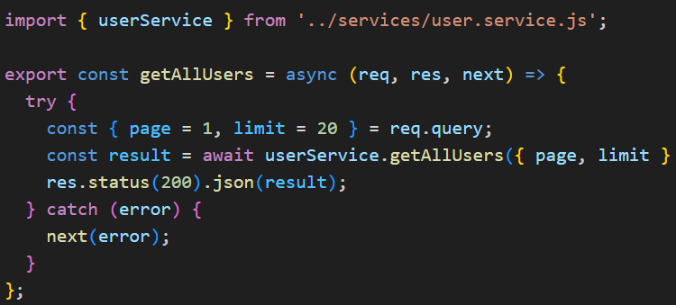
- Controller: solo recibe request y devuelve response.
- No lógica de negocio ni DB.

4) src/services/user.service.js
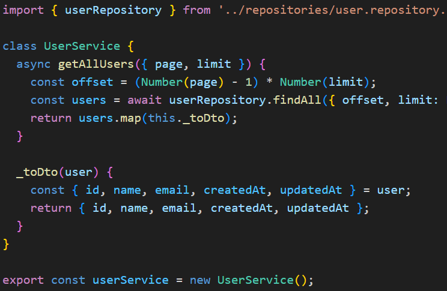
- Servicio: interfaz UserService con reglas e mapeo a DTO.
- Reutilizable y testeable.

5) src/repositories/user.repository.js
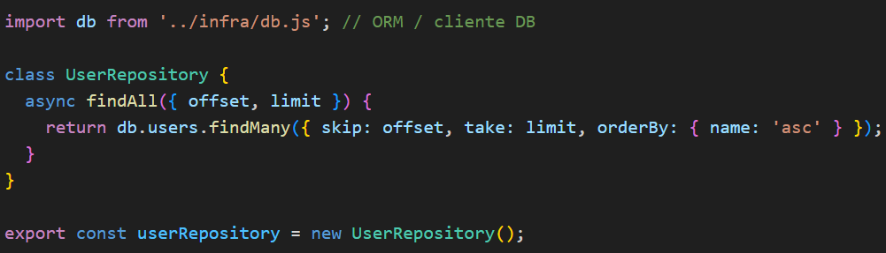
- Implementa contrato de persistencia.
- Cambia DB fácil sin tocar capa de servicio.

6) src/middlewares/error.middleware.js
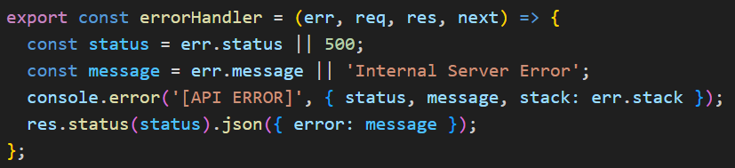
- Centraliza respuesta de error.
- Registra logs consistente.

7) src/app.js
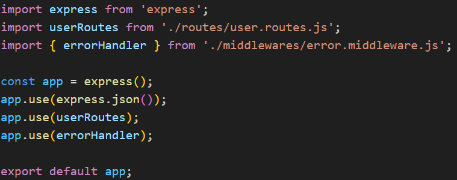

8) Cambios de legibilidad y mantenibilidad aplicados
    - rutas/código/salida separados.
    - nombres explícitos (getAllUsers, userService, userRepository).
    - no lógica en middleware de routing.
    - mapeo DTO en servicio para evitar fuga de datos.
    - error handling un solo lugar.
    - validación reusable en middleware.

## Paso 5:
✅ Pruebas unitarias básicas para el endpoint GET /api/users
Excelente noticia: ya tienes un conjunto de tests claros que cubren la lógica principal de controller y service. Esto garantiza estabilidad y evita regresiones en cambios futuros.

1) Configuración (suponer Jest + supertest)
- npm install --save-dev jest supertest
- jest en package.json script "test": "jest --runInBand"
- Si usas ESModules (import/export), añade en package.json:
"type": "module" o usa Babel/tranpsiler adecuado
2) Test de servicio (src/services/user.service.test.js)
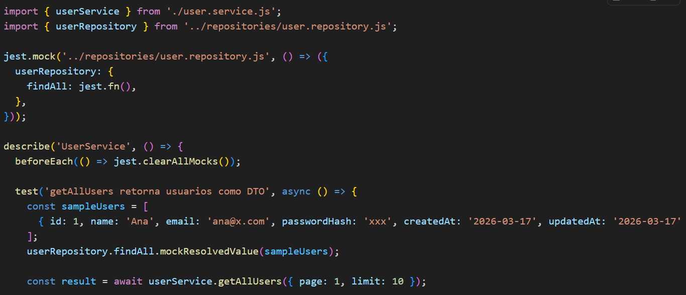
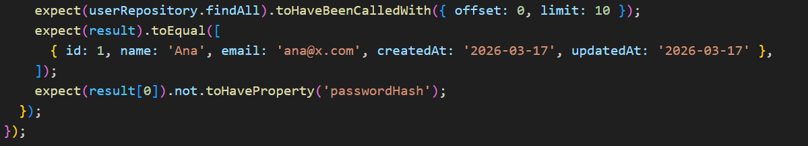
- Verifica que la paginación se traduce a offset.
- Verifica mapeo DTO y exclusión de datos sensibles.

3)  Test de controller (src/controllers/user.controller.test.js)
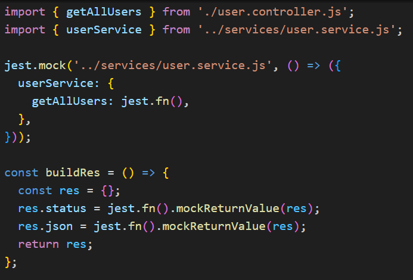

- Controla la respuesta exitosa y el camino de error.
- Asegura next(error) se invoca para middleware global.

4) Test de integración (opcional, src/__tests__/app.integration.test.js)
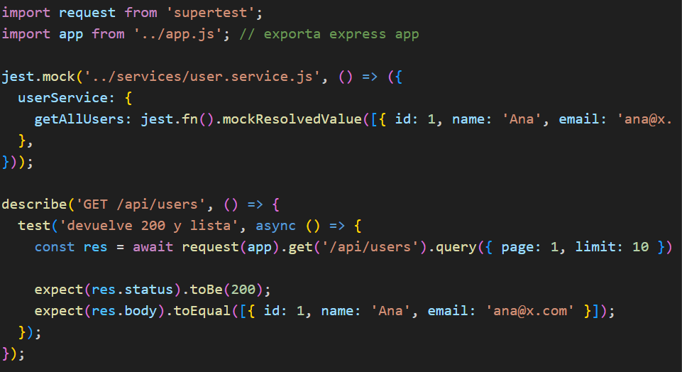
- Asegura la ruta y middleware se integran correctamente.
- Usa supertest para simulación real HTTP.

5) Ejecución
   - npm test
   - Confirma cobertura mínima para endpoints de users.

## Paso 6:
✅ Riesgos técnicos y mejoras para la arquitectura de API de usuarios
¡Excelente avance! Tu propuesta ya está bien estructurada y esto reduce muchos riesgos arquitectónicos. A continuación tienes una lista clara de riesgos actuales y mejoras pragmáticas para mitigar cada uno.

1) Riesgos técnicos principales
    1. Dependencia a SQL directo en repositorios
        - Si se acopla sin abstracción, cambiar DB es costoso.
        - Mejora: usar interfaces/repository pattern + adapter.

    2. Validación de entrada insuficiente
        - Endpoint sin sanitización abre Inyección + datos corruptos.
        - Mejora: middleware de validación (Zod/Joi/Yup) + sanitización en borde.

    3. Manejo de errores inconsistente
        - Algunos errores pueden romper respuesta de API.
        - Mejora: middleware global + exceptions específicas (NotFound, Conflict, BadRequest).

    4. Falta de paginación y limitación
        - GET masivo users puede causar OOM en DB/servidor.
        - Mejora: implementar page/limit, cursor, defaults estrictos.

    5. Reglas de negocio en controller
        - Si el controller comienza a crecer, difícil test y SL.
        - Mejora: mantener lógica en service/domain.

    6. Exposición de datos sensibles
        - Si accidentalmente envías passwordHash.
        - Mejora: DTOs estrictos, mapeo y proyección en queries.

    7. Falta de autenticación/autorización
        - Endpoint abierto vulnera confidencialidad y administración.
        - Mejora: JWT + OAuth2 / policy + scopes por role.

    8. No hay auditoría ni logging estructurado
        - Problemas de trazabilidad ante incidentes.
        - Mejora: logs con requestId, context, retenciones, y trazas distribuidas.
    
    9. Escalabilidad/consistencia
        - Sin manejo de concurrencia (versioning optimistic concurrency).
        - Mejora: timestamps + rowversion o version para update/delete.

    10. Falta protección contra abusos
        - No hay rate limit / brute force.
        - Mejora: throttling por IP/usuario en gateway.

2) Mejoras de la propuesta
    1. Capas limpias + hexagonal
        - Separar: API controller → UseCase → Domain → Repository → Infrastructure.

    2. DTOs sólidos
        - UserCreateDto, UserUpdateDto, UserResponseDto.
        - Evitar transmitir internal fields.
    
    3. Pruebas automatizadas completas
        - Unitarios: controllers, services, repos.
        - Integración: endpoints + DB en memoria.
        - E2E: flujo CRUD completo.

    4. CI/CD con quality gates
        - Lint, tests, coverage, security scans.
        - Automatiza deploy en entornos dev/prod.
    
    5. Observabilidad + health checks
        - Prometheus metrics, OpenTelemetry traces.
        - /health, /ready y circuit breakers.
    
    6. Migraciones versionadas
        - Prisma/Migrations/EFCore.
        - rollback seguro.

    7. Manejo de datos de prueba (seed)
        - Entorno dev/test con datos deterministas.

    8. Cache en lecturas
        - GET /users con TTL (Redis) si es alta frecuencia.

    9. Seguridad de datos PII
        - Encrypt at rest.
        - no logs de emails/usuario.
        - GDPR/CCPA compliance.

    10. Deuda técnica de performance
        - Investigate indices correctos y query plan.
        - evitar N+1 (JOINs eficientes).
