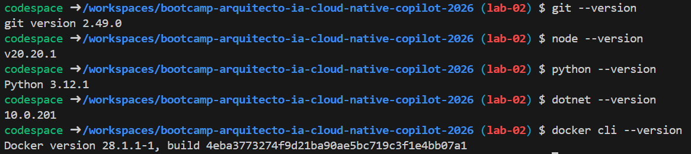
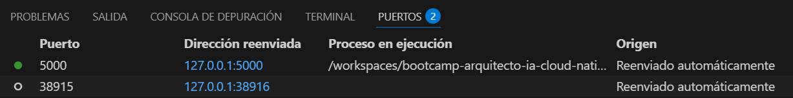
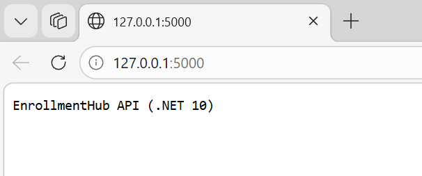

# Evidencias Lab 02

## Objetivo
Configurar un entorno cloud reproducible para desarrollar sin dependencias locales.

## Comandos ejecutados
## Paso 1: 
No se creó codespace porque se escogió el desarrollo local ccon dev containers.

## Paso 2: 
> git --version
> node --version
> python --version
> dotnet --version
> docker cli --version

## Paso 3:
## Para moverse a la carpeta de la plantilla:
> cd templates/dotnet10-api/src

## Para instalar paquetes
> dotnet add package Microsoft.AspNetCore.Authentication.JwtBearer
> dotnet add package Microsoft.IdentityModel.Tokens
> dotnet add package System.IdentityModel.Tokens.Jwt
> dotnet add package Microsoft.EntityFrameworkCore
> dotnet add package Microsoft.EntityFrameworkCore.SqlServer

## Para restaurar dependencias:
> dotnet restore

## Para compilar y correr
> dotnet run

## Resultado esperado
## Paso 2:
Verificación correcta de las herramientas bases.

## Paso 3:
Plantilla seleccionada (dotent10-api) se ejecute correctamente.

## Resultado obtenido
## Paso 2:
Todas las herramientas bases instaladas correctamente.

## Paso 3: 
La plantilla seleccionada se ejecutó correctamente en los puertos. 

Plantilla ejecutada correctamente 

## Problemas y solución
## Problema
No se ejecutaba la api de dotnet por falta de instalación de paquetes

## Solución
Instalar los paquetes faltantes a través del CMD
> dotnet add package Microsoft.AspNetCore.Authentication.JwtBearer
> dotnet add package Microsoft.IdentityModel.Tokens
> dotnet add package System.IdentityModel.Tokens.Jwt
> dotnet add package Microsoft.EntityFrameworkCore
> dotnet add package Microsoft.EntityFrameworkCore.SqlServer