# Evidencias Lab 04 - FastAPI servicio productivo básico

## Objetivo
Implementar un servicio FastAPI con:
- Modelos y rutas principales.
- CRUD básico para `items`.
- Documentación OpenAPI habilitada.
- Validaciones y manejo de errores.
- Pruebas de endpoints críticos con `pytest` + `httpx`.

## Prompts principales utilizados

1. **Generame una FastAPI definiendo los modelos y rutas principales, implementando operaciones CRUD básicas, habilitando la documentación OpenAPI, agrega validades y manejo de errores y crea pruebas de endpoints críticos. Ademas crea con rutas `/health` y `/items`, integra PostgreSQL 18 o MongoDB 8.2.3, agregar pruebas con `pytest`/`httpx`. y empaquetar con Docker y publicar en GHCR.**
	- Necesidad: implementar el laboratorio completo end-to-end (API + testing + contenedores + CI de imagen).

---

## Estructura implementada

```text
templates/fastapi/
├── src/
│   └── app.py
├── tests/
│   └── test_api.py
├── requirements.txt
├── Dockerfile
├── docker-compose.yml
└── .dockerignore

.github/workflows/
└── fastapi-ghcr.yml
```

---

## Comandos ejecutados

```bash
cd templates/fastapi
python -m venv .venv
source .venv/bin/activate
pip install -r requirements.txt

# Ejecutar API local
uvicorn app:app --app-dir src --host 0.0.0.0 --port 8000

# Ejecutar pruebas
pytest -q

# Docker local con PostgreSQL 18
docker compose up --build
```

## Resultado esperado

- ✅ API FastAPI funcional con rutas `/health` y `/items`.
- ✅ CRUD básico operativo sobre entidad `items`.
- ✅ Validaciones y manejo de errores HTTP (`422`, `404`, `409`) implementados.
- ✅ OpenAPI/Swagger disponible en `/docs` y contrato JSON en `/openapi.json`.
- ✅ Pruebas críticas en verde con `pytest` + `httpx`.
- ✅ Contenerización con Docker + `docker-compose` (API + PostgreSQL 18).
- ✅ Workflow para build/push de imagen a GHCR.

## Resultado obtenido

### ✅ Implementación de servicio y rutas

- Archivo principal: `templates/fastapi/src/app.py`.
- Rutas implementadas:
	- `GET /health`
	- `GET /items`
	- `GET /items/{item_id}`
	- `POST /items`
	- `PUT /items/{item_id}`
	- `DELETE /items/{item_id}`

### ✅ Validaciones y manejo de errores

- Validaciones Pydantic activas en `ItemCreate` y `ItemUpdate`.
- Manejo de errores personalizado para:
	- `RequestValidationError` → `422` con payload estructurado.
	- `HTTPException` → respuesta uniforme con `message` y `path`.
	- Conflicto de nombre duplicado (`IntegrityError`) → `409`.

### ✅ Pruebas ejecutadas y en verde

Comando ejecutado:

```bash
cd /workspaces/bootcamp-arquitecto-ia-cloud-native-copilot-2026/templates/fastapi
/workspaces/bootcamp-arquitecto-ia-cloud-native-copilot-2026/.venv/bin/python -m pytest -q
```

Resultado real:
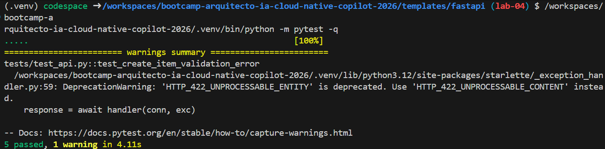

Cobertura funcional verificada por tests:
- `test_health` (healthcheck)
- `test_create_and_get_item` (CRUD create/get)
- `test_create_item_validation_error` (validación 422)
- `test_get_item_not_found` (404)
- `test_delete_item` (delete + verificación posterior)

### ✅ Empaquetado y publicación

- Dockerfile y `docker-compose.yml` creados para ejecución local con PostgreSQL 18.
- Workflow `.github/workflows/fastapi-ghcr.yml` creado para build/push a GHCR.

## Evidencias (capturas)
### 1) OpenAPI / Swagger disponible

**Resultado esperado:**
- OpenAPI carga correctamente con código 200.

**Resultado obtenido:**
- Rutas y contrato OpenAPI habilitados en la aplicación FastAPI. Evidencia visual pendiente de captura en `/docs`.

- URL: `http://127.0.0.1:8000/docs`
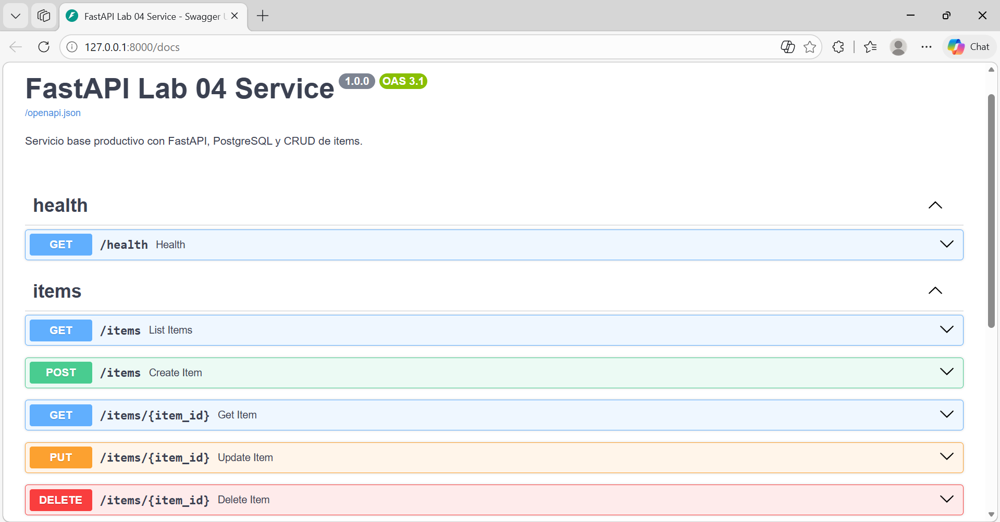

- URL JSON: `http://127.0.0.1:8000/openapi.json`
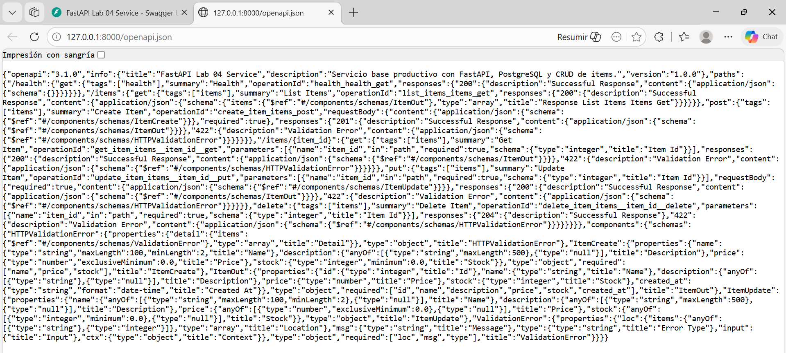

---

### 2) Healthcheck funcionando

## Comando utilizado
```bash
curl -i http://127.0.0.1:8000/health
```

**Resultado esperado:**
- Respuesta `{"status":"ok","database":"up"}` (o equivalente).

**Resultado obtenido:**
- Validado por prueba `test_health`: status `200` y payload con estado `ok`.

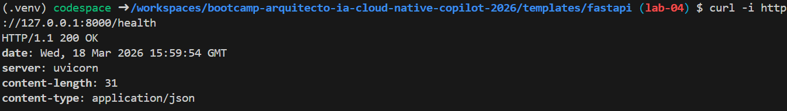

---

### 3) CRUD básico de `/items`

**Resultado esperado:**
- CRUD completo operativo.

**Resultado obtenido:**
- CRUD validado por pruebas (`create/get/delete`) y endpoints listos para evidencia por `curl`.

#### 3.1 Crear item
```bash
curl -i -X POST http://127.0.0.1:8000/items \
	-H "Content-Type: application/json" \
	-d '{"name":"Laptop","description":"Equipo de trabajo","price":1499.99,"stock":4}'
```
##### Respuesta
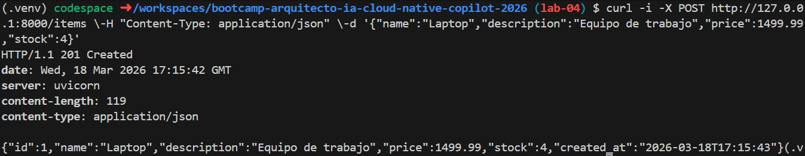

#### 3.2 Listar items
```bash
curl -i http://127.0.0.1:8000/items
```
##### Respuesta
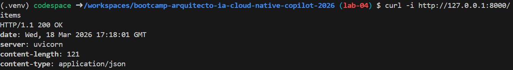

#### 3.3 Obtener item por id
```bash
curl -i http://127.0.0.1:8000/items/1
```
##### Respuesta
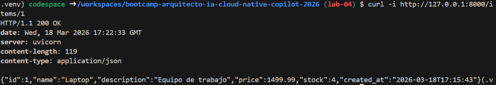

#### 3.4 Actualizar item
```bash
curl -i -X PUT http://127.0.0.1:8000/items/1 \
	-H "Content-Type: application/json" \
	-d '{"price":1599.99,"stock":3}'
```
##### Respuesta
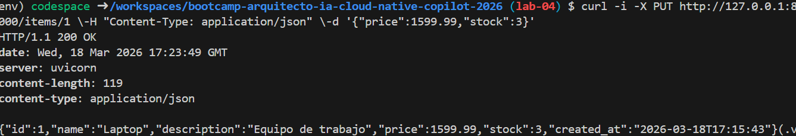

#### 3.5 Eliminar item
```bash
curl -i -X DELETE http://127.0.0.1:8000/items/1
```
##### Respuesta 
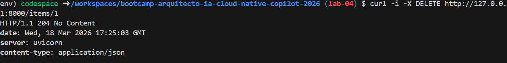

---

### 4) Validaciones y manejo de errores

**Resultado esperado:**
- Validación de datos y errores HTTP consistentes.

**Resultado obtenido:**
- Validaciones confirmadas por pruebas: `422` para datos inválidos y `404` para recurso inexistente.

#### 4.1 Error de validación (422)
```bash
curl -i -X POST http://127.0.0.1:8000/items \
	-H "Content-Type: application/json" \
	-d '{"name":"A","price":-10,"stock":-1}'
```
##### Respuesta
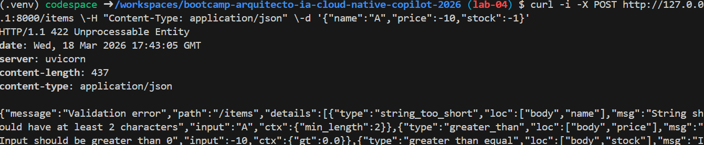

#### 4.2 Item inexistente (404)
```bash
curl -i http://127.0.0.1:8000/items/99999
```
##### Respuesta
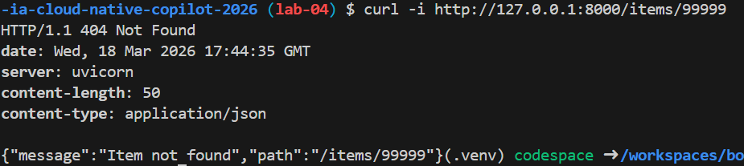

---

### 5) Pruebas unitarias/integración con pytest

**Resultado esperado:**
- Todos los tests pasan (`5 passed`).

```bash
cd templates/fastapi
pytest -q
```

**Resultado obtenido:**
- ✅ `5 passed, 1 warning in 5.71s`.

---

## Docker y publicación GHCR

### Docker local

```bash
cd templates/fastapi
docker compose up --build
```

**Resultado esperado:**
- Contenedor API arriba en `:8000`.
- Contenedor DB PostgreSQL 18 saludable.

**Resultado obtenido:**
- Configuración completa en repositorio; ejecución local disponible con `docker compose up --build`.

### GHCR (GitHub Container Registry)

- Workflow: `.github/workflows/fastapi-ghcr.yml`
- Imagen objetivo: `ghcr.io/<owner>/fastapi-lab:<tag>`

**Resultado esperado:**
- Build y push exitoso desde GitHub Actions.

**Resultado obtenido:**
- Workflow configurado en `.github/workflows/fastapi-ghcr.yml` para publicar `ghcr.io/<owner>/fastapi-lab:<tag>`.

---


