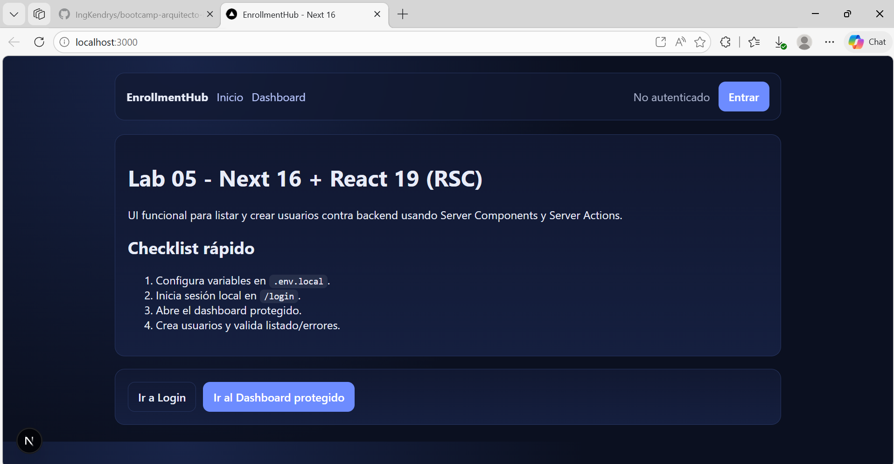
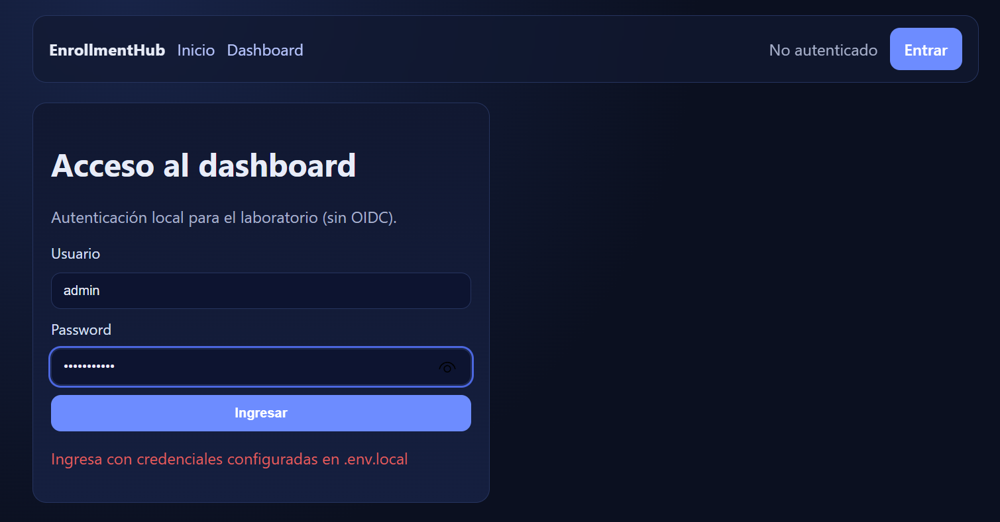
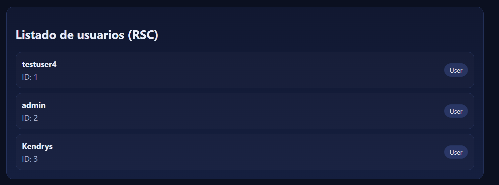
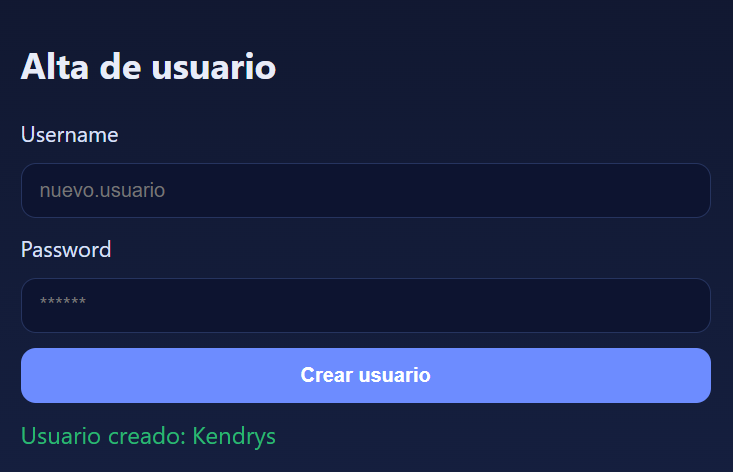
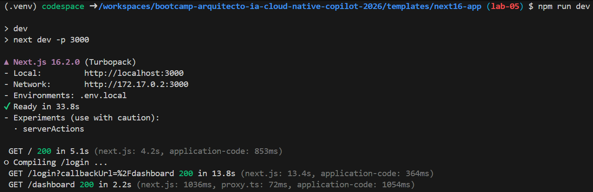

# Evidencias Lab 05 - Next 16 frontend conectado a API

## Objetivo

Construir una UI funcional con Next.js 16 + React 19 para listar y crear datos consumiendo backend, aplicando:
- App Router (`app/`), layouts y rutas.
- Server Components (RSC) para listado.
- Server Action para alta de usuario.
- Protección de rutas local con cookie.
- Manejo de estados de carga y error.

## Prompts principales utilizados

1. **Genera y construye una UI funcional/RSC usando Next.js 16 y React 19 server components para listar y crear datos consumiendo backend... implementa server action... OIDC para proteger rutas...**
   - Necesidad: implementación completa de frontend moderno conectado al backend.

---

## Arquitectura implementada

```text
templates/next16-app/
├── src/
│   ├── app/
│   │   ├── dashboard/
│   │   │   ├── actions.js
│   │   │   ├── error.js
│   │   │   ├── loading.js
│   │   │   ├── page.js
│   │   │   └── user-form.js
│   │   ├── login/
│   │   │   ├── actions.js
│   │   │   ├── login-form.js
│   │   │   └── page.js
│   │   ├── globals.css
│   │   ├── layout.js
│   │   └── page.js
│   ├── lib/backend.js
│   └── proxy.js
├── .env.example
├── next.config.js
├── package.json
└── README.md
```

---

## Comandos ejecutados

```bash
# 1) Backend .NET (Lab 03)
cd templates/dotnet10-api/src
dotnet run

# 2) Frontend Next
cd templates/next16-app
npm install
cp .env.example .env.local
npm run dev

# 3) Validación de compilación
npm run build
```

---

## Resultado esperado

- ✅ UI funcional para listar y crear usuarios desde backend.
- ✅ Rutas con estructura `app/` + layout + página protegida.
- ✅ `Server Action` para crear usuario en `/api/auth/register`.
- ✅ Protección local activa para `/dashboard`.
- ✅ Estados de loading/error visibles y claros.
- ✅ Estilo visual consistente (no plano).

## Resultado obtenido

### ✅ Frontend conectado al backend

- Listado de usuarios vía RSC (`GET /api/users`) con token backend.
- Alta de usuario vía Server Action (`POST /api/auth/register`).

### ✅ Seguridad y rutas protegidas

- Protección de ruta `/dashboard` mediante `proxy.js`.
- Login local en `/login` con validación de `APP_AUTH_USER` y `APP_AUTH_PASSWORD`.
- Sesión local por cookie `lab05_session`.

### ✅ UX técnica

- Estado de loading: `src/app/dashboard/loading.js`.
- Error boundary: `src/app/dashboard/error.js`.
- Formulario con feedback de envío y mensaje de resultado.
- Refactor de estilos globales en `src/app/globals.css`.

### ✅ Build validado

Resultado de compilación:

```text
✓ Compiled successfully
✓ Finished TypeScript
✓ Route (app): /, /login, /dashboard
```

---

## Protección de ruta local

### 1) Configurar credenciales locales

Variables en `.env.local`:

```env
API_BASE_URL=http://127.0.0.1:5000
BACKEND_API_TOKEN=<jwt_backend>

APP_AUTH_USER=admin
APP_AUTH_PASSWORD=Password123
```

### 2) Validación funcional

- Abrir `http://localhost:3000`.
- Ir a `/dashboard` sin sesión -> redirige a `/login`.
- Ingresar credenciales correctas -> redirige a `/dashboard`.

---

## Capturas de evidencia

1. Home `/` con navegación.

2. Redirección a `/login` al entrar a ruta protegida.

3. Dashboard protegido con listado de usuarios.

4. Formulario de alta creando usuario exitosamente.

5. `npm run dev` en verde.


---


