# Evidencias Lab 06

## Objetivo

Implementar un frontend en Angular 21 con Signals que consuma los mismos endpoints del frontend NextJS para autenticación y gestión de usuarios, incluyendo:

- Servicios de acceso a API.
- Listado de usuarios con paginación.
- Formulario de creación de usuario con validaciones.
- Manejo uniforme de errores HTTP.

---

## Comandos ejecutados

> Ajusta rutas/puertos si en tu entorno cambian.

### Prompt

"Generame un Frontend con Angular 21 with Signals que consuma los mismos endpoints de la API que consume el Frontend de NextJS, genera los servicios de acceso a la API, crea componentes de listado con paginación y formulario, maneja errores HTTP de forma uniforme, explicame paso a paso."

```bash
# 1) Ir al template Angular
cd templates/angular21-app

# 2) Instalar dependencias
npm install

# 3) Compilar para validar que no hay errores
npm run build

# 4) Levantar la app en modo desarrollo
npm start
```

### Ejecutar API

#### Opción 1

```bash
# API .NET para pruebas
cd templates/dotnet10-api/src
dotnet run
```

#### Opción 2

```bash
# API FastAPI para pruebas
cd templates/fastapi
uvicorn app.main:app --reload --port 5000
```

---

## Resultado esperado

- La aplicación Angular inicia correctamente en `http://localhost:4200`.
- El login consume `POST /api/auth/login` y almacena token en estado.
- La creación de usuario consume `POST /api/auth/register`.
- El listado consume `GET /api/users` con token Bearer.
- La UI muestra:
  - Validaciones del formulario.
  - Estados de carga.
  - Mensajes de error uniformes (interceptor HTTP).
  - Paginación funcional.

---

## Resultado obtenido

- Frontend Angular 21 con Signals implementado en `templates/angular21-app`.
- Servicios API implementados para endpoints equivalentes a NextJS:
  - `/api/auth/login`
  - `/api/auth/register`
  - `/api/users`
- Interceptor HTTP implementado para normalizar errores.
- Componente dashboard con:
  - Login
  - Alta de usuario
  - Listado paginado
- Build completado correctamente.

### Evidencia

- Terminal con `npm run build` exitoso.
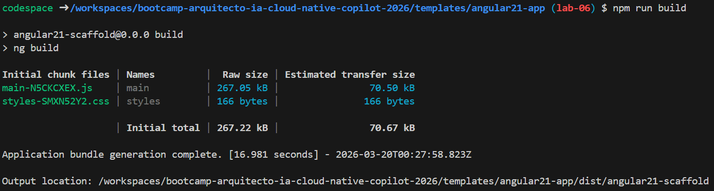
- Pantalla de autenticación (login).
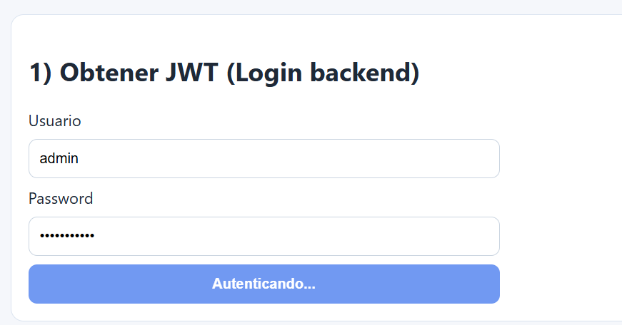
- Pantalla mostrando error manejado por la UI.
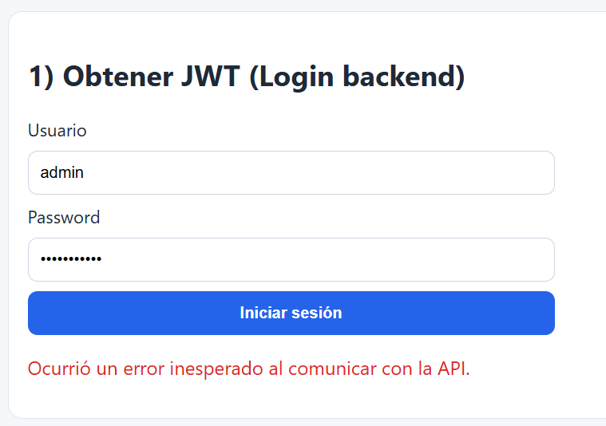
- Pantalla de creación de usuario.
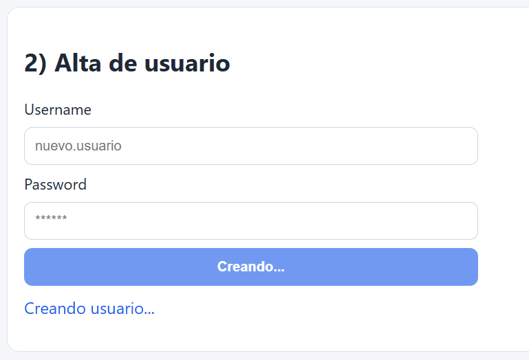
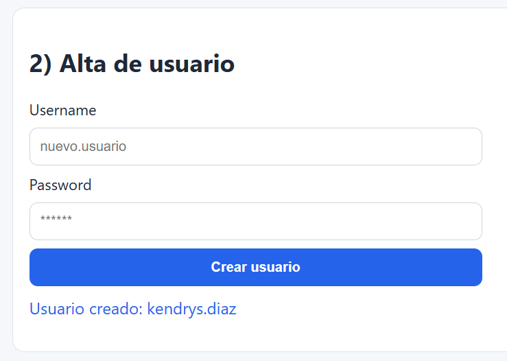
- Pantalla principal de la app.
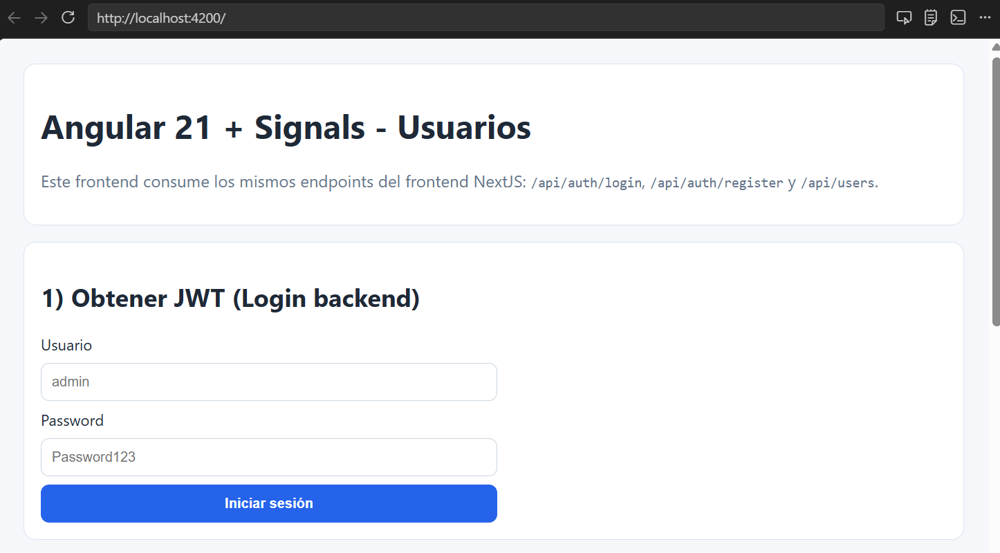

---

## Problemas y solución

1. **Problema:** Diferencias de versión de Angular CLI/Node en intentos iniciales.
	- **Solución:** Se estandarizó el template con Angular 21 compatible en el entorno actual.

2. **Problema:** Ruido por artefactos generados (`node_modules`, builds, temporales).
	- **Solución:** Se trabajó sobre estructura limpia y se validó compilación final del template objetivo.

3. **Problema:** Errores HTTP heterogéneos en respuestas del backend.
	- **Solución:** Se implementó interceptor para mapear respuestas de error a un formato único para la UI.

4. **Problema:** Registro de usuario fallando aunque la API estuviera activa.
	- **Solución:** Se validó el endpoint `POST /api/auth/register` y se detectó error de usuario duplicado (`Usuario existe`, HTTP 400); se ajustó el mensaje del frontend para informar claramente el motivo.

---

## Capturas o logs

1. App Angular iniciada (pantalla principal).

2. Login / autenticación.

3. Usuario creado correctamente.

4. Listado con paginación funcionando.
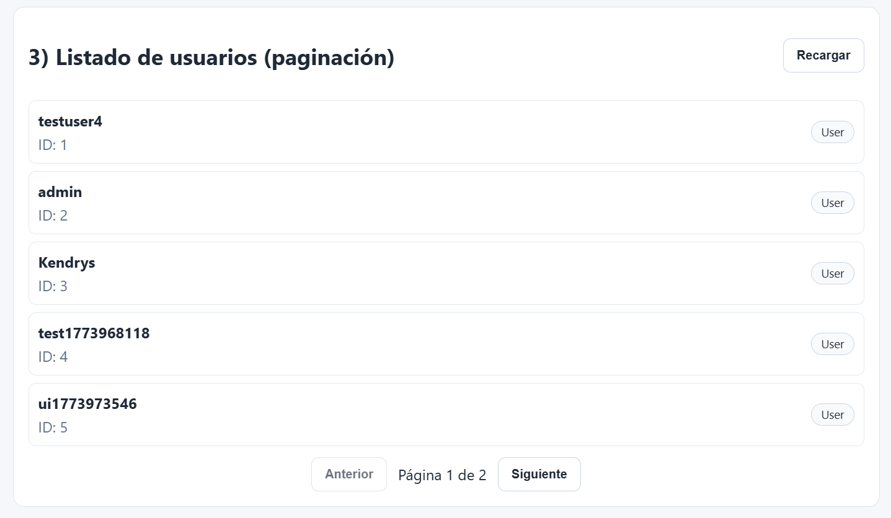

---

## Paso a paso de implementación

1. Se preparó el template Angular 21 en `templates/angular21-app`.
2. Se configuró la URL base de API en `src/environments/environment.ts`.
3. Se crearon servicios de acceso API:
   - `auth-api.service.ts` para login.
   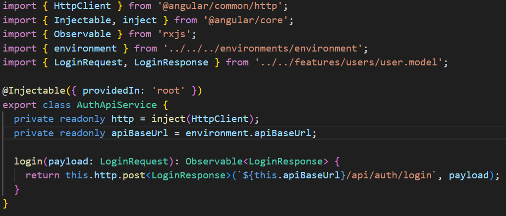
   - `users-api.service.ts` para registro y listado.
   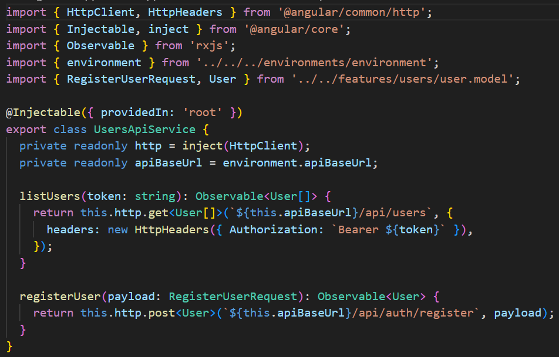
4. Se implementó interceptor HTTP global para normalizar errores.
   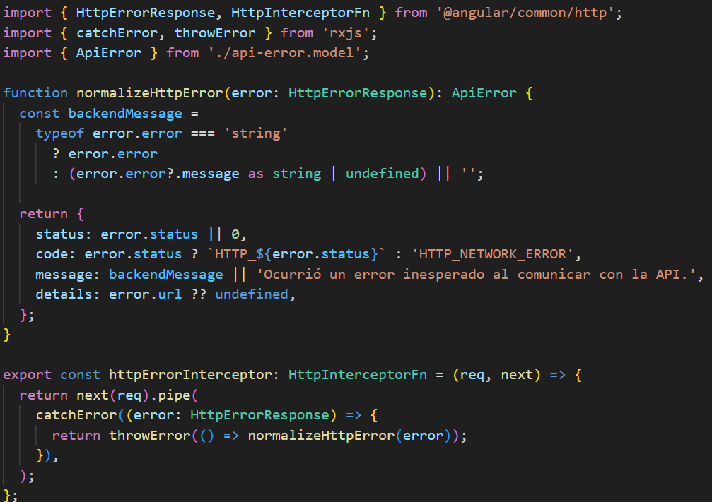
5. Se modelaron contratos (`User`, `LoginRequest`, `LoginResponse`, etc.).
6. Se implementó `UsersStore` con Signals para:
   - estado de autenticación,
   - carga de usuarios,
   - mensajes de error,
   - paginación.
   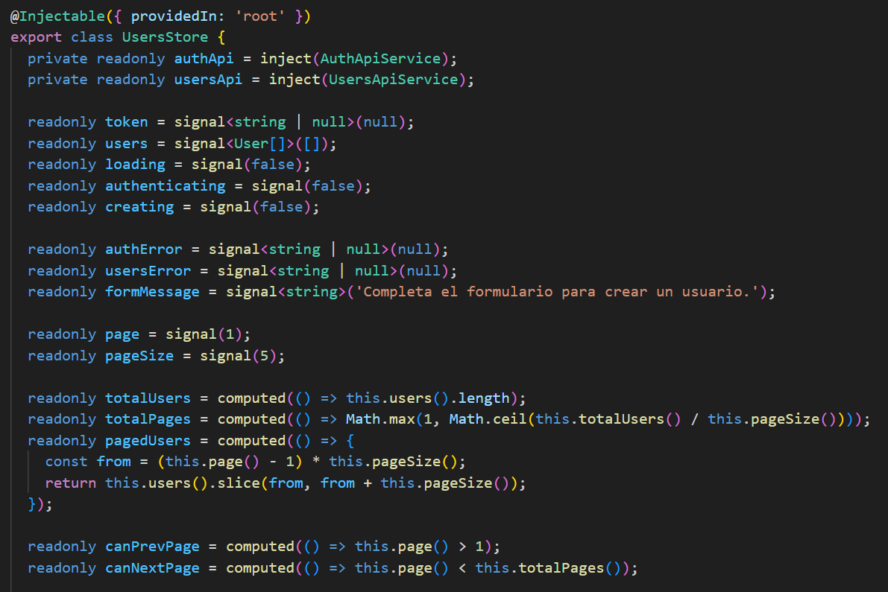
7. Se construyó `UsersDashboardComponent` con:
   - formulario de login,
   - formulario de creación,
   - listado de usuarios paginado,
   - feedback visual de estados.
   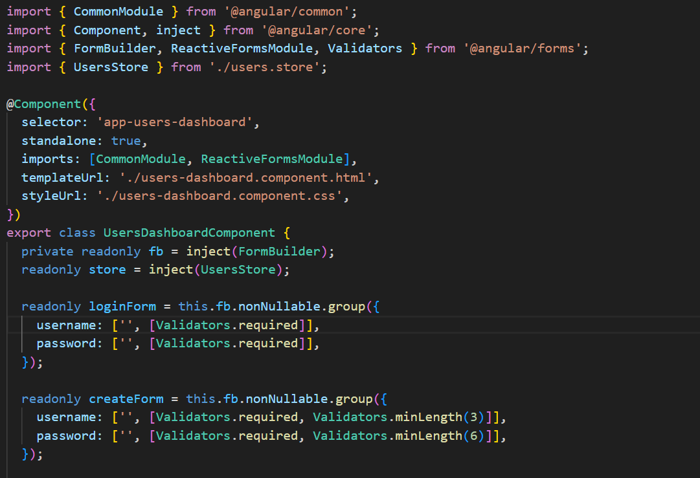
8. Se conectó ruteo principal para mostrar el dashboard por defecto.
9. Se ejecutó `npm run build` para validación técnica.

10. Se documentó la evidencia del lab.

