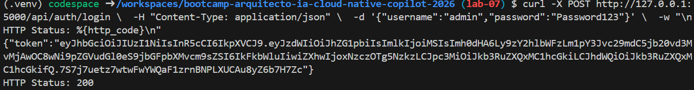
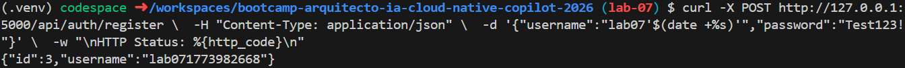
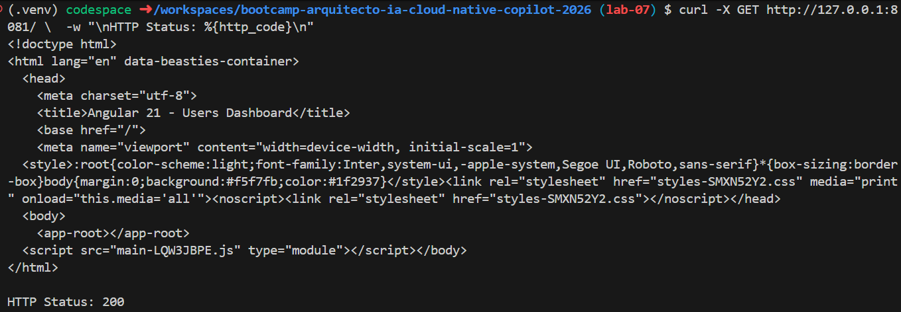

# Evidencias Lab 07

## Objetivo

Empaquetar servicios (backend .NET y frontend Angular) en imágenes Docker, ejecutar los contenedores localmente, validar su funcionamiento y publicar las imágenes en GitHub Container Registry (GHCR).

---

## Comandos ejecutados

> Ajusta rutas/puertos según tu entorno.

### Prompt

"Generame y logra el objetivo de empaquetar servicios en imágenes y publicarlas en GitHub Container Registry (GHCR). Explicame paso a paso: Dockerfile para .NET Core, Dockerfile para Angular, build local, test en contenedores, tagging e integración con GHCR."

### Paso a paso

#### 1) Verificar Dockerfiles existentes

```bash
# Ver estructura de templates
ls -la templates/*/Dockerfile

# Resultado: Existen Dockerfiles para NextJS y FastAPI, pero falta Angular
```

#### 2) Crear Dockerfile para Angular

```bash
# Crear multi-stage Dockerfile (Node build → Nginx runtime)
cat > templates/angular21-app/Dockerfile << 'EOF'
FROM node:20-alpine AS build
WORKDIR /app
COPY package*.json ./
RUN npm ci
COPY . .
RUN npm run build

FROM nginx:1.27-alpine AS runtime
COPY --from=build /app/dist/angular21-app/browser /usr/share/nginx/html
EXPOSE 80
CMD ["nginx", "-g", "daemon off;"]
EOF
```

#### 3) Crear .dockerignore para todos los proyectos

```bash
# Backend .NET
cat > templates/dotnet10-api/.dockerignore << 'EOF'
bin
obj
.vs
.git
.gitignore
README.md
*.log
EOF

# Frontend Angular
cat > templates/angular21-app/.dockerignore << 'EOF'
node_modules
dist
.git
.gitignore
README.md
*.log
.angular
EOF

# Frontend NextJS (por consistencia)
cat > templates/next16-app/.dockerignore << 'EOF'
node_modules
.next
.git
.gitignore
README.md
*.log
EOF
```

#### 4) Build de imágenes locales

```bash
# Backend .NET
docker build -t lab07-backend:local templates/dotnet10-api

# Frontend Angular
docker build -t lab07-frontend-angular:local templates/angular21-app

# Verificar que se crearon
docker images | grep lab07
```

#### 5) Ajustar Dockerfile del backend (permisos SQLite)

```bash
# Ubicar línea USER 10001 en Dockerfile y agregar chown
# El archivo debe incluir:
# FROM base
# COPY --from=build --chown=10001:10001 /out .
# RUN touch /app/data.db && chown -R 10001:10001 /app
# USER 10001
```

#### 6) Agregar migración automática en Program.cs

```bash
# En templates/dotnet10-api/src/Program.cs, antes de app.Run()
# Agregar bloque para ejecutar migraciones y seed:

# using (var scope = app.Services.CreateScope())
# {
#     var db = scope.ServiceProvider.GetRequiredService<AppDbContext>();
#     db.Database.Migrate();  // Crea tabla Users si no existe
#
#     if (!db.Users.Any(u => u.Username == "admin"))
#     {
#         db.Users.Add(new User
#         {
#             Username = "admin",
#             PasswordHash = BCrypt.Net.BCrypt.HashPassword("Password123"),
#             Role = "Admin"
#         });
#         db.SaveChanges();
#     }
# }
```

#### 7) Rebuild después de ajustes

```bash
docker build -t lab07-backend:local templates/dotnet10-api
docker build -t lab07-frontend-angular:local templates/angular21-app
```

#### 8) Test local con contenedores

```bash
# Lanzar backend
docker run -d --name backend -p 5000:8080 lab07-backend:local

# Lanzar frontend
docker run -d --name frontend -p 8081:80 lab07-frontend-angular:local

# Esperar 3 segundos a que inicien
sleep 3

# Test 1: Login (debe retornar JWT)
curl -X POST http://127.0.0.1:5000/api/auth/login \
  -H "Content-Type: application/json" \
  -d '{"username":"admin","password":"Password123"}' \
  -w "\nHTTP Status: %{http_code}\n"

##### Resultado



# Test 2: Register nuevo usuario
curl -X POST http://127.0.0.1:5000/api/auth/register \
  -H "Content-Type: application/json" \
  -d '{"username":"lab07'$(date +%s)'","password":"Test123!"}' \
  -w "\nHTTP Status: %{http_code}\n"

##### Resultado


# Test 3: Frontend (debe retornar HTML)
curl -X GET http://127.0.0.1:8081/ \
  -w "\nHTTP Status: %{http_code}\n"

##### Resultado



# Limpiar contenedores
docker stop backend frontend
docker rm backend frontend
```

#### 9) Tagging para GHCR

```bash
# Tag backend
docker tag lab07-backend:local ghcr.io/ingkendrys/backend:lab07

# Tag frontend
docker tag lab07-frontend-angular:local ghcr.io/ingkendrys/frontend-angular:lab07

# Verificar
docker images | grep ghcr.io
```

#### 10) Crear Personal Access Token (PAT)

```bash
# 1. Ir a https://github.com/settings/tokens (Classic Tokens)
# 2. "Generate new token (classic)"
# 3. Seleccionar scopes:
#    - write:packages
#    - read:packages
#    - repo
# 4. Copiar el token generado

# Guardar el token en variable (reemplaza con tu token real)
export GITHUB_TOKEN="ghp_xxxxxxxxxxxxxxxxxxxx"
```

#### 11) Autenticar Docker con GHCR

```bash
# Login con el PAT
echo "$GITHUB_TOKEN" | docker login ghcr.io -u IngKendrys --password-stdin

# Debe retornar: "Login Succeeded"
```

#### 12) Push a GitHub Container Registry

```bash
# Push backend
docker push ghcr.io/ingkendrys/backend:lab07

# Push frontend
docker push ghcr.io/ingkendrys/frontend-angular:lab07

# Verificar en GitHub: https://github.com/IngKendrys/bootcamp-arquitecto-ia-cloud-native-copilot-2026/pkgs/container/
```

---

## Resultado esperado

1. ✅ Dockerfiles creados para Angular y .NET
2. ✅ Imágenes compiladas sin errores
3. ✅ Contenedores levantados y respondiendo a requests
4. ✅ Tests HTTP retornan 200 OK (login, register, frontend)
5. ✅ Imágenes taggeadas para GHCR
6. ✅ Imágenes publicadas en GitHub Container Registry

## Resultado obtenido

**Imágenes disponibles en:**
- `ghcr.io/ingkendrys/backend:lab07`
- `ghcr.io/ingkendrys/frontend-angular:lab07`

---

## Problemas encontrados y soluciones

### Problema 1: Dockerfile para Angular no existía
**Síntoma:** No había forma de empaquetar el frontend en imagen.  
**Solución:** Crear Dockerfile multi-stage (Node build → Nginx runtime) que optimiza tamaño final.

### Problema 2: Backend retornaba HTTP 500 en login
**Síntoma:** Contenedor iniciaba pero `/api/auth/login` retornaba error interior.  
**Causa 1:** Tabla `Users` no existía en SQLite.  
**Solución:** Agregar `db.Database.Migrate()` en Program.cs al iniciar la app.  
**Causa 2:** Admin user no existía.  
**Solución:** Seed automático de usuario "admin:Password123" si la tabla está vacía.

### Problema 3: Backend no podía escribir en SQLite dentro del contenedor
**Síntoma:** EF Core migrations fallaban con "permission denied" en `data.db`.  
**Causa:** Usuario `10001` (nonroot) sin permisos en la carpeta `/app`.  
**Solución:** Agregar `RUN chown -R 10001:10001 /app` y `RUN touch /app/data.db` en Dockerfile antes de cambiar usuario.

### Problema 4: Docker push fallaba con "permission_denied: unexpected scopes"
**Síntoma:** `docker push` retornaba error de permisos.  
**Causa:** Token de GitHub sin scopes `write:packages`.  
**Solución:** Crear Personal Access Token (PAT) clásico con scopes: `write:packages`, `read:packages`, `repo`.

---

## Resumen técnico

| Componente | Imagen Base | Tamaño aprox | Puertos | Usuario |
|-----------|-----------|-----------|---------|---------|
| Backend .NET | mcr.microsoft.com/dotnet/aspnet:10.0-alpine | ~250MB | 8080 | 10001 |
| Frontend Angular | nginx:1.27-alpine | ~50MB | 80 | nginx |

**Comandos clave para reproducir:**
```bash
# Build
docker build -t lab07-backend:local templates/dotnet10-api
docker build -t lab07-frontend-angular:local templates/angular21-app

# Test
docker run -p 5000:8080 lab07-backend:local
docker run -p 8081:80 lab07-frontend-angular:local

# Tag y push
docker tag lab07-backend:local ghcr.io/ingkendrys/backend:lab07
echo "$PAT" | docker login ghcr.io -u IngKendrys --password-stdin
docker push ghcr.io/ingkendrys/backend:lab07
docker push ghcr.io/ingkendrys/frontend-angular:lab07
```

