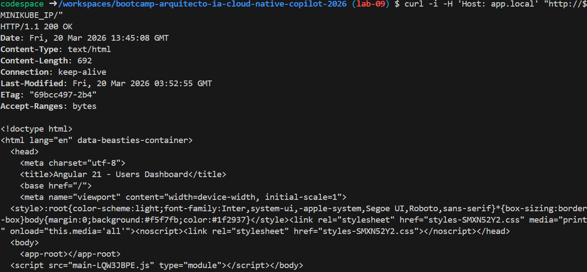
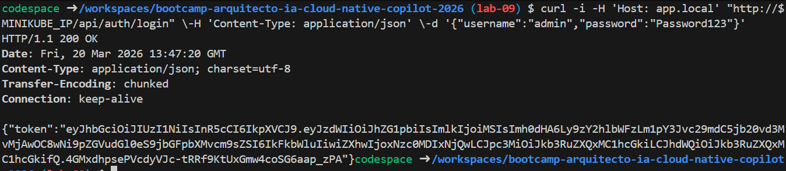
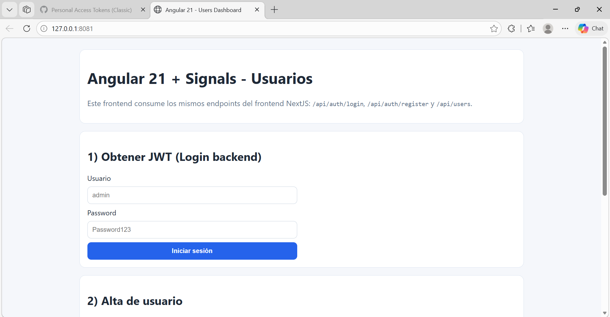

# Evidencias Lab 09

## Objetivo

Desplegar backend y frontend en Kubernetes con Helm usando imágenes en GHCR, validar funcionamiento end-to-end y extender la solución con API Gateway (Kong + Konga).

## Comandos ejecutados

### Propmt utilizado

"Generame un kubernetes accesible para desplegar backend y frontend en cluster usando Helm, siguiendo los siguientes pasos: revisa chart y values por ambiente, actualiza referencias de imagen/tag, ejecución instalación o upgrade de Helm, verificación pods, services e ingress, y finalmente realiza un smoke test funcional, además explicame paso a paso."

```bash
# 1) Configurar credenciales GHCR para imágenes privadas
kubectl create namespace app --dry-run=client -o yaml | kubectl apply -f -
kubectl -n app delete secret ghcr-creds --ignore-not-found
kubectl -n app create secret docker-registry ghcr-creds \
	--docker-server=ghcr.io \
	--docker-username=IngKendrys \
	--docker-password="$GHCR_PAT"

# 2) Desplegar/actualizar app con Helm
helm upgrade --install app infra/helm/app -n app --create-namespace
kubectl rollout restart deployment/api-dotnet deployment/app-next -n app
kubectl rollout status deployment/api-dotnet -n app --timeout=180s
kubectl rollout status deployment/app-next -n app --timeout=180s

# 3) Verificación de recursos
kubectl get pods -n app -o wide
kubectl get svc -n app
kubectl get ingress -n app

# 4) Smoke test por ingress de la app
MINIKUBE_IP=$(minikube ip)
curl -i -H 'Host: app.local' "http://$MINIKUBE_IP/"
curl -i -H 'Host: app.local' "http://$MINIKUBE_IP/api/auth/login" \
	-H 'Content-Type: application/json' \
	-d '{"username":"admin","password":"Password123"}'

# 5) Extensión: Kong + Konga
helm repo add kong https://charts.konghq.com
helm repo update
helm upgrade --install kong kong/kong -n kong --create-namespace

kubectl apply -f infra/k8s/kong/backend-ingress-kong.yaml
kubectl apply -f infra/k8s/kong/konga.yaml
kubectl rollout status deployment/konga -n kong --timeout=180s

# 6) Validación por gateway (Kong)
curl -i -H 'Host: kong.local' "http://$MINIKUBE_IP:30327/api/auth/login" \
	-H 'Content-Type: application/json' \
	-d '{"username":"admin","password":"Password123"}'

curl -sS -D - -o /dev/null -H 'Host: kong.local' "http://$MINIKUBE_IP:30327/api/auth/login" \
	-H 'Content-Type: application/json' \
	-d '{"username":"admin","password":"Password123"}' | grep -i 'x-ratelimit'

kubectl get svc -n app api-dotnet -o jsonpath='{.spec.type}{"\n"}'
```

## Resultado esperado

- Pods de backend y frontend en estado `Running`.
- Servicios internos en `ClusterIP`.
- Ingress funcional para `app.local`.
- Smoke test del frontend y login API en `HTTP 200`.
- Ruta API expuesta a través de Kong (`kong.local`) y no por exposición directa del servicio.
- Al menos un plugin activo en Kong (rate limiting).

## Resultado obtenido

- ✅ Despliegue Helm funcional en Kubernetes.
- ✅ Backend y frontend en `Running`.
- ✅ Ingress `enrollmenthub` funcionando.
- ✅ Frontend respondió `HTTP/1.1 200 OK` con HTML Angular.
- ✅ Login backend respondió `HTTP/1.1 200 OK` con JWT.
- ✅ Kong operativo y ruta `/api` publicada por gateway.
- ✅ Plugin `rate-limiting` activo; headers `X-RateLimit-*` visibles en respuesta.
- ✅ Servicio `api-dotnet` confirmado como `ClusterIP` (sin exposición externa directa).

## Problemas y solución

- **Problema:** `ImagePullBackOff` con `unauthorized` al descargar imágenes GHCR.
- **Causa:** faltaba autenticación válida para imágenes privadas (`imagePullSecrets` + PAT con scope `read:packages`).
- **Solución:**
	1. Agregar `imagePullSecrets` en `values.yaml` y deployments.
	2. Crear secret `ghcr-creds` en namespace `app` con PAT válido.
	3. Reaplicar Helm y reiniciar deployments.

## Capturas o logs

### Smoke test app ingress





### Frontend corriendo


### Logs/indicadores clave
- `deployment "api-dotnet" successfully rolled out`
- `deployment "app-next" successfully rolled out`
- `deployment "konga" successfully rolled out`
- Respuesta por Kong con headers:
	- `X-RateLimit-Remaining-Minute`
	- `X-RateLimit-Limit-Minute`
