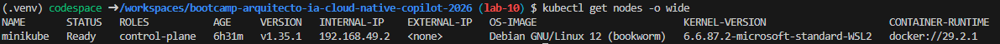
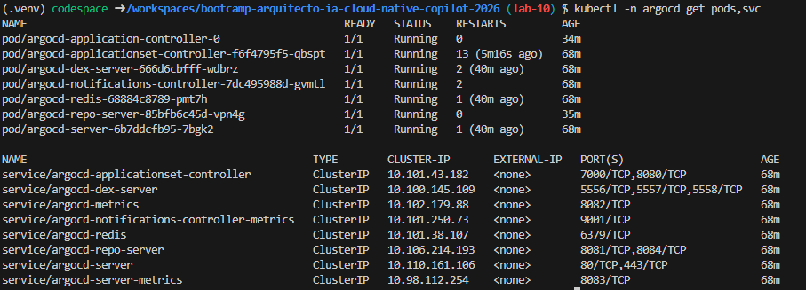
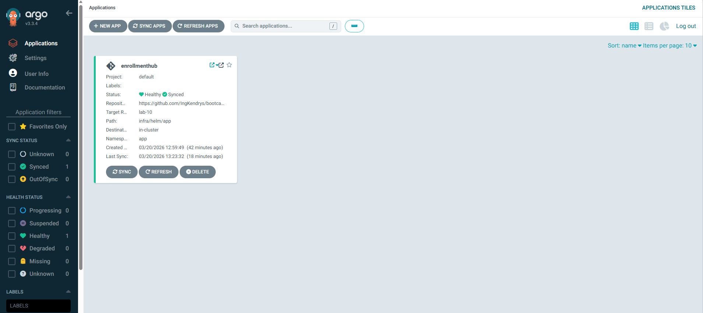
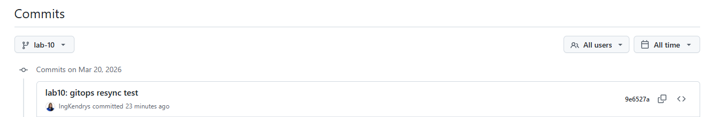
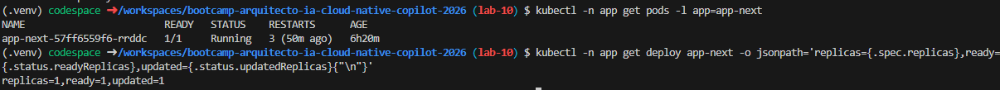

# Evidencias Lab 10

## Objetivo
Implementar y validar GitOps con Argo CD, asegurando que el estado declarado en Git se sincroniza con el estado real del clúster Kubernetes, incluyendo prueba de cambio en Git y resincronización.

## Comandos ejecutados

### Paso 1: Validar clúster y contexto Kubernetes
```bash
kubectl config current-context
kubectl get nodes -o wide
kubectl get ns
```

#### Validación de clúster activo
```bash
kubectl get nodes -o wide
```


### Paso 2: Verificar Argo CD desplegado
```bash
kubectl -n argocd get pods,svc
```
#### Verificación de la lista de pods de Argo CD en estado running


### Paso 3: Aplicar/actualizar recurso Application
```bash
kubectl apply -f infra/gitops/argocd/app.yaml
kubectl -n argocd get application enrollmenthub -o wide
```

### Paso 4: Forzar refresco de estado (si aplica)
```bash
kubectl -n argocd annotate application enrollmenthub argocd.argoproj.io/refresh=hard --overwrite
kubectl -n argocd get application enrollmenthub -o jsonpath='{.status.sync.status}{" / "}{.status.health.status}{"\n"}'
```

### Paso 5: Exponer Argo CD en localhost con puerto alterno
```bash
kubectl -n argocd port-forward svc/argocd-server 9090:80
```
Abrir en navegador:
- `https://localhost:9090`


### Paso 6: Obtener credenciales iniciales de acceso
```bash
kubectl -n argocd get secret argocd-initial-admin-secret -o jsonpath='{.data.password}' | base64 -d; echo
```
Datos de login:
- Usuario: `admin`
- Password: valor del comando anterior.

Vista en el navegador: 


### Paso 7: Ejecutar prueba GitOps (cambio en Git)
Se modificó el manifiesto de frontend para provocar cambio declarativo (escala de réplicas).

```bash
git add infra/helm/app/templates/deploy-frontend.yaml
git commit -m "lab10: gitops resync test"
git push origin lab-10
```
Evidencia del commit/push: 


### Paso 8: Validar resincronización en Argo CD
```bash
kubectl -n argocd get application enrollmenthub -w
```

### Paso 9: Confirmar estado aplicado en clúster
```bash
kubectl -n app get deploy app-next -o jsonpath='replicas={.spec.replicas},ready={.status.readyReplicas},updated={.status.updatedReplicas}{"\n"}'
kubectl -n app get pods -l app=app-next
```
Resultado:


### Propmt utilizado
Generame la administración de despliegues declarativos sincronizados desde GIT, es decir, GitOPS con Argo CD, siguiendo el paso a paso de crear recurso Aplication de argo CD, apuntando al repositorio y rama objetivo, habilita sync policy según estrategia, verifica estado Synced y Healthy y al finalizar, pruebas de cambio en git y resincronización.

## Resultado esperado
- Argo CD debe gestionar la Application desde Git y reflejar estado de sincronización correcto.
- La Application `enrollmenthub` debe alcanzar `Synced` y `Healthy`.
- Un cambio en manifiestos versionados (rama `lab-10`) debe provocar resincronización.
- El estado en Kubernetes debe coincidir con la definición declarativa en Git.

## Resultado obtenido
- Se validó acceso a Argo CD por `https://localhost:9090` usando port-forward en puerto alterno.
- Se aplicó y verificó la Application `enrollmenthub`.
- Estado final confirmado: `Synced / Healthy`.
- La prueba GitOps fue exitosa: tras el commit/push, el despliegue de frontend quedó en `replicas=1,ready=1,updated=1`.

## Problemas y solución
1. Problema: Argo CD no cargaba en localhost.
	- Causa: clúster minikube detenido y/o puerto por defecto en conflicto.
	- Solución: iniciar clúster, validar pods de Argo CD y usar port-forward en `9090`.

2. Problema: estado `Sync Unknown` durante reconciliación.
	- Causa: componentes internos de Argo CD en recuperación tras reinicio del clúster.
	- Solución: refresco forzado de la Application y verificación hasta `Synced / Healthy`.

3. Problema: necesidad de evidencia clara del cambio GitOps.
	- Solución: ejecutar commit/push controlado y validar convergencia con `kubectl -w` + estado final de deployment.
