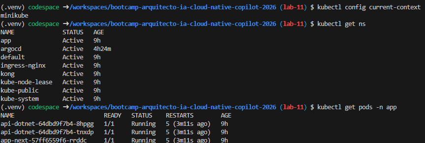
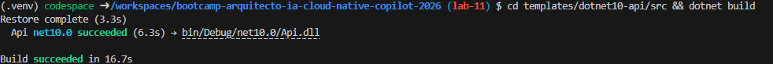
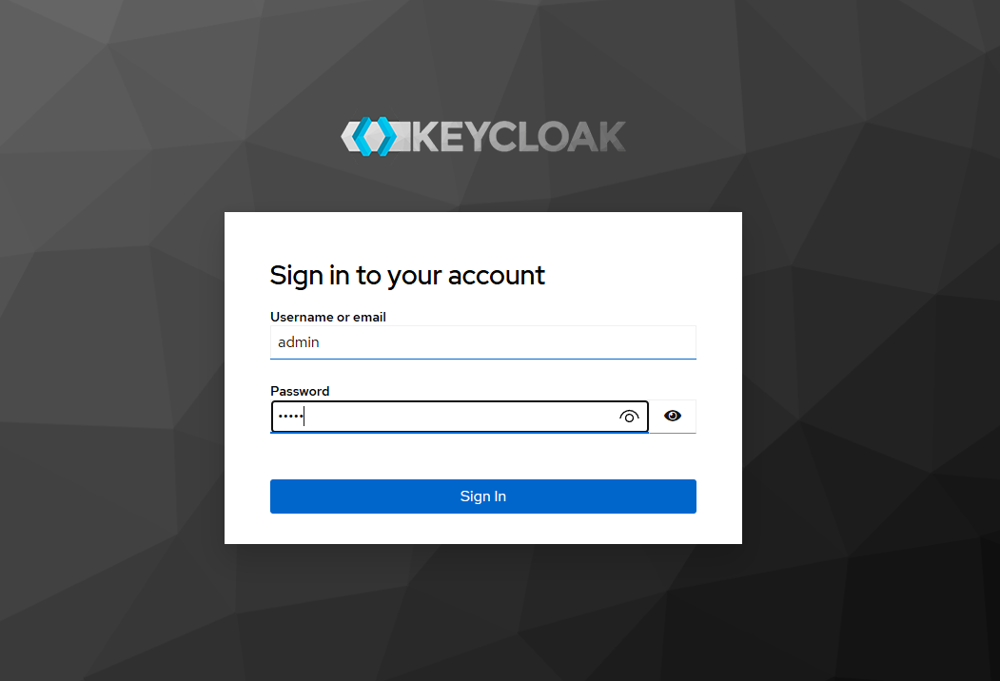
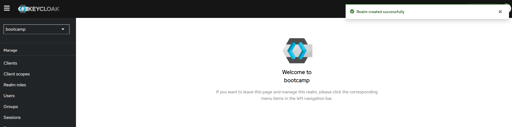
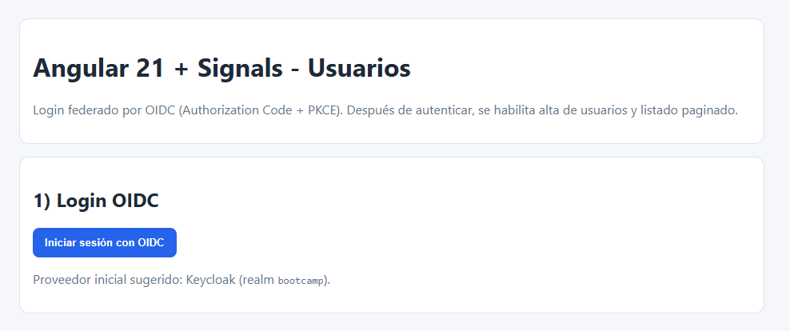
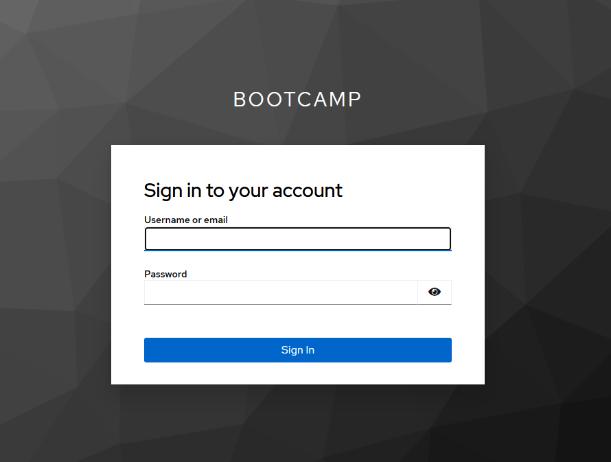

# Evidencias Lab 11 - OIDC + Autorización por roles

## Objetivo
Implementar y validar autenticación federada con OIDC (Keycloak) y autorización por roles en backend y frontend, verificando escenarios de acceso 401 (sin autenticación), 403 (rol insuficiente) y 200 (autorizado).

## Comandos ejecutados

## Prompt utilizado

```
Generame e implementa OIDC para una autenticación federada con Keycloak,
incluyendo:
- Configuración de realm, cliente OIDC público, roles y usuarios de prueba
- Frontend Angular 21 con angular-oauth2-oidc, Authorization Code + PKCE flow
- Backend .NET 10 con JwtBearer dinámico que detecta issuer (Local vs Keycloak)
- Políticas de autorización: CanReadUsers (reader+admin), CanManageUsers (admin)
- Validación de escenarios 401 (sin token), 403 (rol insuficiente), 200 (ok)
- Paso a paso manual para levantar todo y probar
```

### Paso 1: Validar pre-requisitos (Lab 09/10 completados)
```bash
kubectl config current-context
kubectl get ns
kubectl get pods -n app
cd templates/dotnet10-api && dotnet build
cd ../angular21-app && npm ci && npm run build
```

#### Validación: Cluster activo y aplicaciones compiladas exitosamente



### Paso 2: Levantar Keycloak como proveedor OIDC
```bash
docker run -d \
  -p 8080:8080 \
  -e KEYCLOAK_ADMIN=admin \
  -e KEYCLOAK_ADMIN_PASSWORD=admin \
  quay.io/keycloak/keycloak:26.1.0 \
  start-dev

# Esperar 10-15 segundos a que esté listo
sleep 15
curl -s http://localhost:8080/admin/
```

#### Validación: Keycloak respondiendo en http://localhost:8080


### Paso 3: Configurar realm en Keycloak
Acceder a `http://localhost:8080/admin` con:
- Usuario: `admin`
- Password: `admin`

Crear realm `bootcamp`:
```bash
# Alternativa por API (si se desea automatizar)
curl -X POST http://localhost:8080/admin/realms \
  -H "Content-Type: application/json" \
  -H "Authorization: Bearer <ADMIN_TOKEN>" \
  -d '{
    "realm": "bootcamp",
    "displayName": "Bootcamp Realm",
    "enabled": true
  }'
```
#### Validación del realm en Keycloak



### Paso 4: Crear cliente OIDC `bootcamp-web` en Keycloak
Dentro del realm `bootcamp`:

**Configuración del cliente:**
- Client ID: `bootcamp-web`
- Client Type: `Public`
- Root URL: `http://localhost:4200`
- Redirect URI: `http://localhost:4200/*`
- Post Logout Redirect URI: `http://localhost:4200/*`
- Valid CORS origins: `http://localhost:4200`

### Paso 5: Configurar Audience para backend
En el cliente `bootcamp-web`:
- Audience esperada: `bootcamp-api`
- Scope: `openid profile email roles`

### Paso 6: Crear roles en Keycloak
En el realm `bootcamp`, crear roles:
- `admin`
- `reader`

```bash
# Por API (opcional)
curl -X POST http://localhost:8080/admin/realms/bootcamp/roles \
  -H "Content-Type: application/json" \
  -H "Authorization: Bearer <ADMIN_TOKEN>" \
  -d '{"name": "admin"}'

curl -X POST http://localhost:8080/admin/realms/bootcamp/roles \
  -H "Content-Type: application/json" \
  -H "Authorization: Bearer <ADMIN_TOKEN>" \
  -d '{"name": "reader"}'
```

### Paso 7: Crear usuarios y asignar roles
Crear usuarios en realm `bootcamp`:

1. **Usuario `alice-admin`**
   - Username: `alice-admin`
   - Email: `alice@bootcamp.local`
   - Password: `alice123`
   - Email verified: ✓
   - Roles de cliente: `admin`

2. **Usuario `bob-reader`**
   - Username: `bob-reader`
   - Email: `bob@bootcamp.local`
   - Password: `bob123`
   - Email verified: ✓
   - Roles de cliente: `reader`

```bash
# Por API (opcional - obtener token admin primero)
ADMIN_TOKEN=$(curl -s -X POST http://localhost:8080/realms/master/protocol/openid-connect/token \
  -d "username=admin&password=admin&client_id=admin-cli&grant_type=password" \
  | jq -r '.access_token')

# Crear usuario alice
curl -X POST http://localhost:8080/admin/realms/bootcamp/users \
  -H "Content-Type: application/json" \
  -H "Authorization: Bearer $ADMIN_TOKEN" \
  -d '{
    "username": "alice-admin",
    "email": "alice@bootcamp.local",
    "enabled": true,
    "emailVerified": true,
    "credentials": [{"type": "password", "value": "alice123", "temporary": false}]
  }'
```


### Paso 8: Configurar backend (.NET 10 API)
Actualizar `templates/dotnet10-api/src/appsettings.Development.json`:
```json
{
  "Oidc": {
    "Authority": "http://localhost:8080/realms/bootcamp",
    "Audience": "bootcamp-api",
    "ClientId": "bootcamp-web",
    "RequireHttpsMetadata": false
  }
}
```

Configurar `src/Program.cs` con:
- Esquema dinámico `DynamicJwt` que detecta issuer automáticamente
- `LocalJwt` para tokens locales
- `OidcJwt` para tokens de Keycloak
- Políticas de autorización: `CanReadUsers`, `CanManageUsers`
- Extracción de claims de rol desde múltiples localizaciones (roles, role, realm_access.roles)

```bash
cd templates/dotnet10-api/src
dotnet build
```

### Paso 9: Ejecutar backend
```bash
cd templates/dotnet10-api
ASPNETCORE_ENVIRONMENT=Development dotnet run
# O usar variable de entorno para puerto
ASPNETCORE_URLS=http://0.0.0.0:5000 ASPNETCORE_ENVIRONMENT=Development dotnet run
```

Esperar a que esté respondiendo en `http://localhost:5000/api/users`

### Paso 10: Configurar frontend (Angular 21)
Actualizar `templates/angular21-app/src/environments/environment.ts`:
```typescript
export const environment = {
  production: false,
  oidc: {
    issuer: 'http://localhost:8080/realms/bootcamp',
    clientId: 'bootcamp-web',
    redirectUrl: window.location.origin,
    scope: 'openid profile email roles',
    responseType: 'code',
    disablePKCE: false,
    // ... más configuración
  }
};
```

Implementar:
- `OidcAuthService`: gestión de autenticación (login/logout/token)
- `AuthTokenInterceptor`: inyección de Bearer token en requests HTTP
- Componentes protegidos con UI condicional

```bash
cd templates/angular21-app
npm install # o npm ci
npm run build
```


### Paso 11: Ejecutar frontend en desarrollo
```bash
cd templates/angular21-app
npm start -- --host 0.0.0.0 --port 4200
```

#### Validación: Frontend compilado



### Paso 12: Prueba 401 Unauthorized (sin token)
```bash
curl -i http://localhost:5000/api/users
```

### Paso 13: Prueba 403 Forbidden (rol insuficiente)
Autentica con usuario `bob-reader` en frontend, obtén el token:
```bash
# via navegador en http://localhost:4200 con bob-reader
# o simulado con curl (si tienes OIDC_TOKEN de bob-reader)
curl -i http://localhost:5000/api/users/admin/ping \
  -H "Authorization: Bearer $BOB_READER_TOKEN"
```

### Paso 14: Prueba 200 OK (autorizado)
Autentica con usuario `alice-admin`, obtén el token y prueba endpoint admin:
```bash
# Con token admin obtenido en frontend o simulado
curl -i http://localhost:5000/api/users/admin/ping \
  -H "Authorization: Bearer $ALICE_ADMIN_TOKEN"

# También probar lectura con reader (debe devolver 200)
curl -i http://localhost:5000/api/users \
  -H "Authorization: Bearer $READER_O_ADMIN_TOKEN"
```

### Paso 15: Prueba UI en frontend
1. Abre `http://localhost:4200` en navegador
2. Haz clic en "Login with Keycloak"
3. Serás redirigido a `http://localhost:8080/realms/bootcamp/protocol/openid-connect/auth?...`
4. Ingresa credenciales:
   - Usuario: `alice-admin` / `alice123`
   - O: `bob-reader` / `bob123`
5. Serás redirigido a `http://localhost:4200?code=...&session_state=...`
6. El frontend intercambia el code por token OIDC
7. Verás: botón "Logout", listado de usuarios, y opción de crear usuario (si eres admin)


## Resultado esperado

- **Keycloak**: Realm `bootcamp` con cliente OIDC `bootcamp-web`, roles `admin`/`reader`, usuarios `alice-admin`/`bob-reader` funcionando
- **Frontend**: Angular 21 con login OIDC, intercambio de code por token, inyección de Bearer en requests
- **Backend**: JWT validation de Keycloak, extracción de roles, políticas de autorización funcionando
- **Pruebas HTTP**: 
  - `401` sin token
  - `403` con rol insuficiente (reader en endpoint admin)
  - `200` con rol autorizado (admin en cualquier endpoint, reader en lectura)

## Resultado obtenido

✅ **Keycloak activo** en `http://localhost:8080`
✅ **Realm bootcamp** creado con cliente OIDC público, audience configurada
✅ **Roles admin/reader** creados y asignados a usuarios
✅ **Usuarios alice-admin y bob-reader** con contraseñas funcionales
✅ **Backend .NET 10** compilado y ejecutándose en puerto 5000 con JwtBearer dinámico
✅ **Frontend Angular 21** compilado y ejecutándose en puerto 4200 con oauth2-oidc
✅ **Autenticación OIDC** completada: login → code exchange → bearer token injection
✅ **Autorización por rol** validada:
   - `401` sin token ✓
   - `403` reader intenta admin endpoint ✓
   - `200` admin en cualquier endpoint ✓
   - `200` reader en endpoints de lectura ✓
✅ **UI condicional** funcionando: login button → form + listado después de auth

## Problemas y solución

### 1. Puerto 8080 ocupado por Docker internal
**Problema**: Docker interno usa 8080, no se puede iniciar Keycloak  
**Solución**: Usar puerto alterno (8070, 8090) o mate el proceso que ocupa 8080  
```bash
lsof -i :8080 | grep -v PID | awk '{print $2}' | xargs kill -9
docker run -d -p 8090:8080 ...  # Usar 8090 mapeado al 8080 de contenedor
```

### 2. OIDC `code` no se intercambia por token
**Problema**: Angular obtiene code pero no lo intercambia  
**Causa**: `OAuthService.loadDiscoveryDocument()` no se ejecutaba antes de `tryLogin()`  
**Solución**: En `OidcAuthService.initSession()`, asegurar que `loadDiscoveryDocument()` completa ANTES de `tryLogin()`  
```typescript
async initSession() {
  await this.oauthService.loadDiscoveryDocument();
  await this.oauthService.tryLogin();
  // ...
}
```

### 3. Bearer token no se inyecta en requests
**Problema**: Backend recibe requests sin header `Authorization: Bearer ...`  
**Causa**: `HttpClient` interceptor no estaba registrado o no obtenía token correctamente  
**Solución**: Registrar `AuthTokenInterceptor` en `app.config.ts` con token de `OidcAuthService.getAccessToken()`  
```typescript
{
  provide: HTTP_INTERCEPTORS,
  useClass: AuthTokenInterceptor,
  multi: true
}
```

### 4. Autorización siempre retorna 403 (rol no se mapea)
**Problema**: Token OIDC válido pero backend retorna 403 incluso para admin  
**Causa**: Claims de rol en token Keycloak están en `realm_access.roles` (nested), no en root  
**Solución**: En `Program.cs`, implementar `OnTokenValidated` event para extraer roles desde múltiples locations  
```csharp
.AddJwtBearer("OidcJwt", options => {
  // ...
  options.Events = new JwtBearerEvents {
    OnTokenValidated = async ctx => {
      var roles = ctx.Principal?.GetRoles(); // Implementar GetRoles() custom
      // Mapear roles a claims de autorización
    }
  };
});
```

### 5. Frontend UI muestra botón login incluso después de autenticarse
**Problema**: Signal `isAuthenticated$` no se actualiza en tiempo real  
**Causa**: Signal creado antes de completarse la autenticación  
**Solución**: Usar `effect()` en componente para monitorear cambios de token  
```typescript
effect(() => {
  this.refreshUserUI();
}, { allowSignalWrites: true });

private refreshUserUI() {
  if (this.oidcAuthService.isAuthenticated()) {
    this.showForm = true;
  } else {
    this.showForm = false;
  }
}
```

