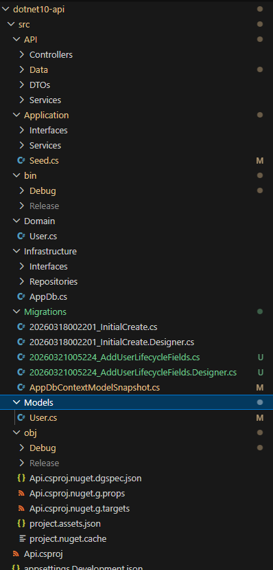
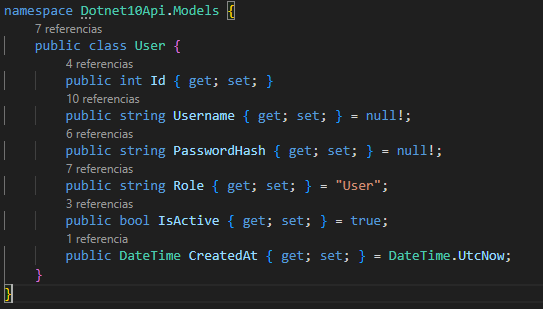
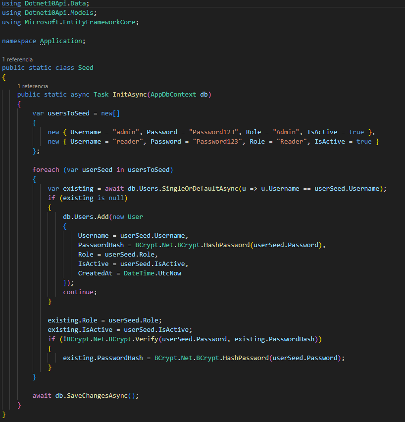

# Evidencias Lab 13 - EF Core Migrations y Seed Idempotente

## Objetivo
Implementar gestión evolutiva de esquema y datos semilla en .NET (API del Lab 03), validando:
- migración base,
- segunda migración con cambio controlado,
- seed idempotente,
- historial de migraciones,
- y ausencia de duplicados en datos semilla.

## Comandos ejecutados

## Prompt inicial del lab

```text
Generame la gestión evolutiva de esquema y datos semmilla en .NET utilizando la API del laboratorio 03, inicialmente define modelos iniciales, genera migración base, aplica base de datos, implementa seed idempotente y crea una segunda migración con cambio controlado, para validar obtendremos el historial de migraciones y el seed aplicado sin duplicados.
```

### Paso 1: Revisar estructura de la API base (Lab 03)
```bash
cd templates/dotnet10-api/src
ls
```

Se confirmó presencia de:
- `Api.csproj`
- `Program.cs`
- `API/Data/AppDbContext.cs`
- `Models/User.cs`
- `Migrations/`



### Paso 2: Definir modelo inicial + cambio controlado
Se trabajó sobre `User` agregando campos evolutivos controlados:
- `IsActive` (`bool`, default `true`)
- `CreatedAt` (`DateTime`)



### Paso 3: Configurar EF Core en `AppDbContext`
Se mantuvo índice único por username y se agregó configuración de default para `IsActive`.

### Paso 4: Implementar seed idempotente
Se reemplazó seed legacy por seed idempotente que:
- inserta si no existe,
- actualiza rol/estado si ya existe,
- evita duplicados por `Username`.

Usuarios seed:
- `admin` / `Password123` / `Admin`
- `reader` / `Password123` / `Reader`



### Paso 5: Integrar seed en arranque de la aplicación
Se eliminó inserción manual inline y se centralizó en:
```csharp
await Seed.InitAsync(db);
```

### Paso 6: Instalar EF CLI y generar segunda migración
```bash
dotnet tool install --global dotnet-ef --version 10.0.5
export PATH="$PATH:$HOME/.dotnet/tools"

cd templates/dotnet10-api/src
dotnet-ef migrations add AddUserLifecycleFields --context Dotnet10Api.Data.AppDbContext
```

Migración generada:
- `20260321005224_AddUserLifecycleFields`

### Paso 7: Aplicar base de datos
```bash
cd templates/dotnet10-api/src
dotnet-ef database update --context Dotnet10Api.Data.AppDbContext
```

Se aplicó correctamente la migración:
- `20260321005224_AddUserLifecycleFields`

### Paso 8: Validar historial de migraciones
```bash
python3 - <<'PY'
import sqlite3
conn=sqlite3.connect('templates/dotnet10-api/src/data.db')
cur=conn.cursor()
for row in cur.execute('SELECT MigrationId, ProductVersion FROM __EFMigrationsHistory ORDER BY MigrationId;'):
    print(row)
conn.close()
PY
```

Resultado observado:
- `20260318002201_InitialCreate`
- `20260321005224_AddUserLifecycleFields`

### Paso 9: Validar seed idempotente sin duplicados
```bash
python3 - <<'PY'
import sqlite3
conn=sqlite3.connect('templates/dotnet10-api/src/data.db')
cur=conn.cursor()
for row in cur.execute("SELECT Username, COUNT(*) FROM Users WHERE Username IN ('admin','reader') GROUP BY Username ORDER BY Username;"):
    print(row)
conn.close()
PY
```

Resultado observado:
- `('admin', 1)`
- `('reader', 1)`

### Paso 10: Re-ejecutar app y re-validar idempotencia
Se ejecutó nuevamente la API para disparar seed y se volvió a consultar conteos.

Resultado:
- `admin = 1`
- `reader = 1`

## Resultado esperado
- Evolución controlada del esquema con al menos 2 migraciones.
- Seed funcional e idempotente (sin duplicar registros).
- Historial consistente en `__EFMigrationsHistory`.

## Resultado obtenido
- ✅ Modelo actualizado con campos evolutivos (`IsActive`, `CreatedAt`).
- ✅ Segunda migración generada y aplicada.
- ✅ Historial de migraciones consistente con 2 entradas.
- ✅ Seed aplicado y validado sin duplicados (`admin=1`, `reader=1`).
- ✅ Compilación del proyecto exitosa.

## Problemas y solución
1. Problema: `dotnet ef` no disponible.
   - Solución: instalar herramienta global `dotnet-ef` y exportar `PATH`.

2. Problema: múltiples `DbContext` detectados por EF.
   - Solución: especificar contexto explícito `--context Dotnet10Api.Data.AppDbContext`.

3. Problema: SQLite no permite `ALTER TABLE` con default no constante (`CURRENT_TIMESTAMP`).
   - Solución: ajustar migración para usar default constante en `CreatedAt` y alinear snapshot/designer.

4. Problema: puerto `5000` ocupado en una ejecución de validación.
   - Solución: ejecutar validación en puerto alterno (`ASPNETCORE_URLS=http://127.0.0.1:5010`) o validar por SQL directo.
