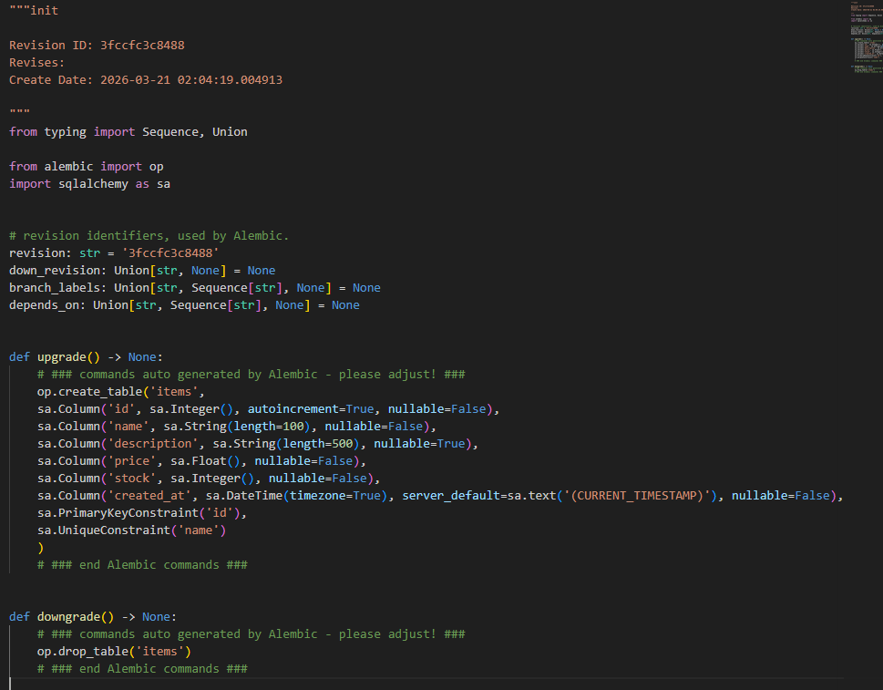
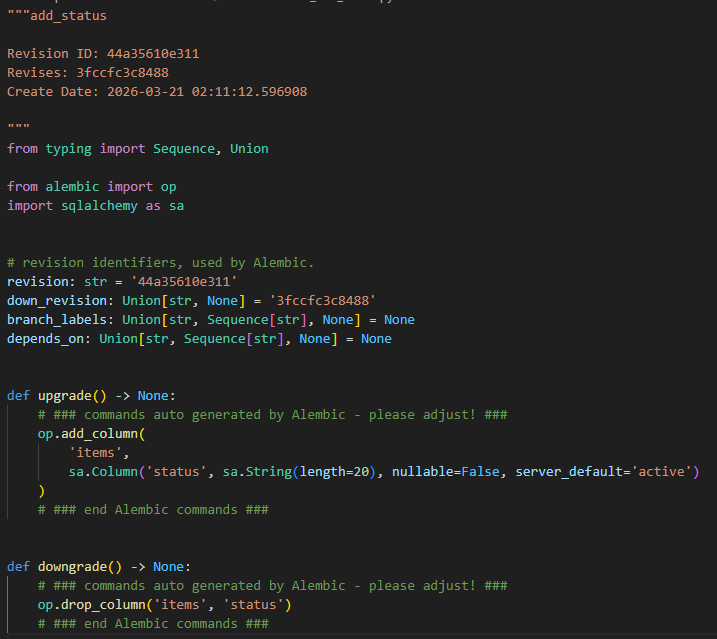

# Evidencias Lab 14 - Alembic para FastAPI

## Objetivo
Versionar cambios de base de datos en stack Python/FastAPI con Alembic, validando flujo completo:
- configuración `alembic.ini` y `env.py`,
- revisión inicial,
- `upgrade head`,
- cambio de modelo,
- nueva revisión,
- validación de datos y versión aplicada.

## Comandos ejecutados

## Prompt inicial del lab

```text
Generame un versionamiento de cambios de base de datos en stack Python en el Laboratorio 04, confura el alembic-ini y env.py, crea revision inicial, aplica upgrade, introduce un cambi de modelo y genera nueva revision y valida datos.
```

### Paso 1: Preparar Alembic en plantilla FastAPI
```bash
cd templates/fastapi
```

Se ajustó:
- `alembic.ini`
- `alembic/env.py`
- `alembic/script.py.mako`
- carpeta `alembic/versions/`

### Paso 2: Crear revisión inicial
```bash
/workspaces/bootcamp-arquitecto-ia-cloud-native-copilot-2026/.venv/bin/python -m alembic revision --autogenerate -m "init"
```

Resultado:
- Revisión generada: `3fccfc3c8488_init.py`


### Paso 3: Aplicar upgrade inicial
```bash
/workspaces/bootcamp-arquitecto-ia-cloud-native-copilot-2026/.venv/bin/python -m alembic upgrade head
```

Resultado:
- DB migrada a versión inicial.

### Paso 4: Insertar dato de control previo al cambio
```bash
/workspaces/bootcamp-arquitecto-ia-cloud-native-copilot-2026/.venv/bin/python - <<'PY'
import sqlite3
conn=sqlite3.connect('fastapi_lab.db')
cur=conn.cursor()
cur.execute("INSERT INTO items(name, description, price, stock) VALUES (?,?,?,?)", ('monitor-24', 'monitor base para validar migración', 199.99, 10))
conn.commit()
print(cur.execute('SELECT id FROM items WHERE name=?', ('monitor-24',)).fetchone())
conn.close()
PY
```

Resultado:
- Item base insertado para validar persistencia tras migración evolutiva.

### Paso 5: Introducir cambio de modelo
Cambio aplicado en `src/models.py`:
- Nuevo campo `status: str` en `Item`.

También actualizado en `src/app.py`:
- `ItemCreate`, `ItemUpdate`, `ItemOut` y creación de item con `status`.

### Paso 6: Generar revisión evolutiva
```bash
/workspaces/bootcamp-arquitecto-ia-cloud-native-copilot-2026/.venv/bin/python -m alembic revision --autogenerate -m "add_status"
```

Resultado:
- Revisión generada: `44a35610e311_add_status.py`


### Paso 7: Corregir migración por limitación SQLite
Problema detectado:
- SQLite no permite `ADD COLUMN ... NOT NULL` sin default.

Solución aplicada en revisión `add_status`:
- `server_default='active'` para columna `status`.

### Paso 8: Aplicar upgrade final
```bash
/workspaces/bootcamp-arquitecto-ia-cloud-native-copilot-2026/.venv/bin/python -m alembic upgrade head
```

Resultado:
- Upgrade exitoso a `44a35610e311`.

### Paso 9: Validar versión y datos
```bash
/workspaces/bootcamp-arquitecto-ia-cloud-native-copilot-2026/.venv/bin/python - <<'PY'
import sqlite3
conn=sqlite3.connect('fastapi_lab.db')
cur=conn.cursor()
print('migrations=', [r[0] for r in cur.execute('SELECT version_num FROM alembic_version')])
print('existing_item=', cur.execute("SELECT id,name,status FROM items WHERE name='monitor-24'").fetchone())
print('active_items=', cur.execute("SELECT COUNT(*) FROM items WHERE status='active'").fetchone()[0])
conn.close()
PY
```

Resultado observado:
- `migrations = ['44a35610e311']`
- `existing_item = (1, 'monitor-24', 'active')`
- `active_items = 1`

## Resultado esperado
- Flujo reproducible de migraciones en FastAPI.
- Revisión inicial y revisión evolutiva aplicadas.
- Datos previos conservados tras cambio de esquema.

## Resultado obtenido
- ✅ Configuración Alembic completada y funcional.
- ✅ Revisión inicial creada y aplicada.
- ✅ Cambio de modelo (`status`) versionado y aplicado.
- ✅ Historial de versión en `alembic_version` correcto.
- ✅ Dato previo conservado y enriquecido con default `status='active'`.

## Problemas y solución

1. Problema: Alembic incompleto en plantilla (config mínima insuficiente).
   - Solución: completar `alembic.ini`, `env.py`, `script.py.mako`, `versions/`.

2. Problema: SQLite error al agregar columna `NOT NULL` sin default.
   - Solución: ajustar migración `add_status` con `server_default='active'`.

