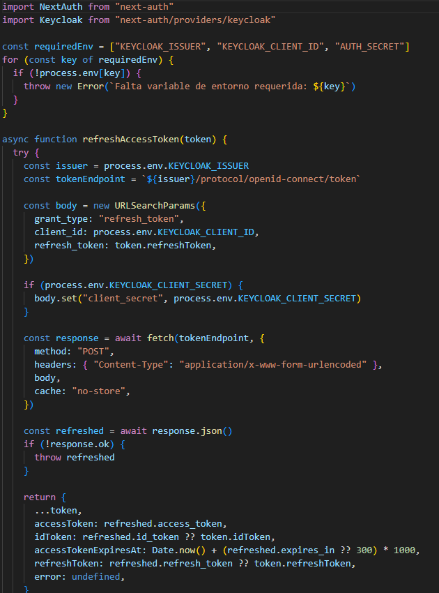
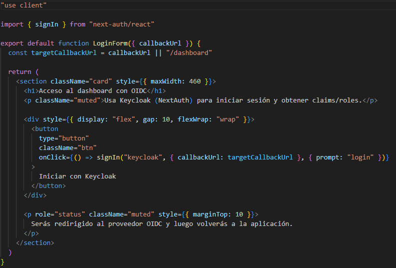
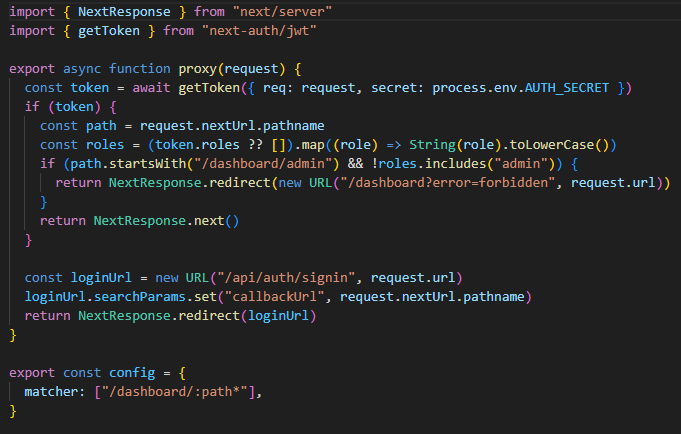
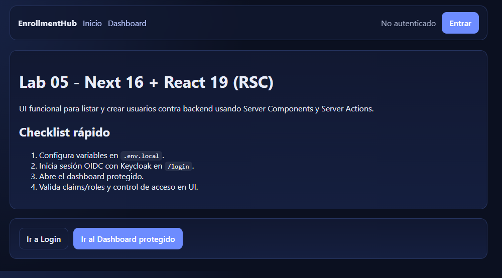
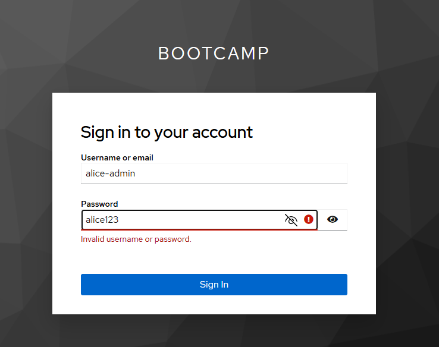
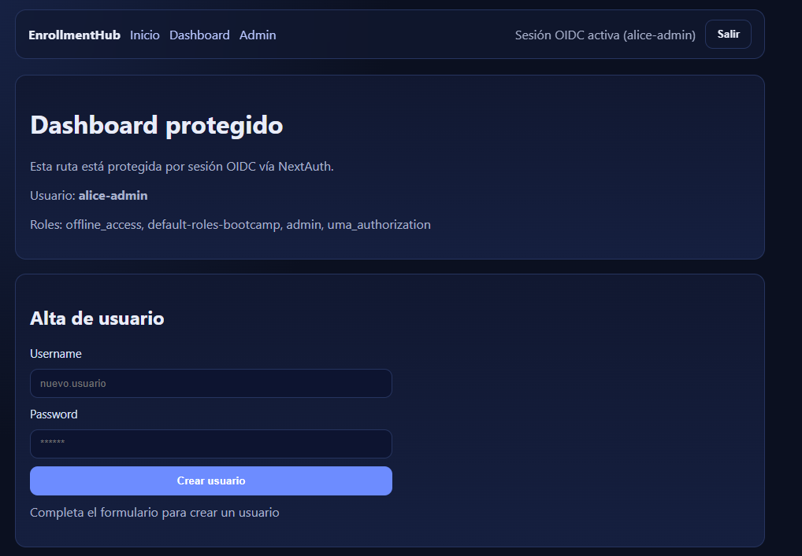
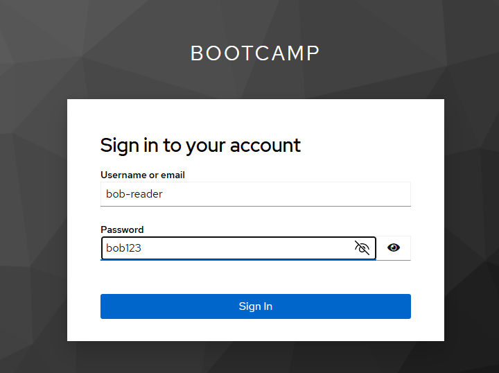
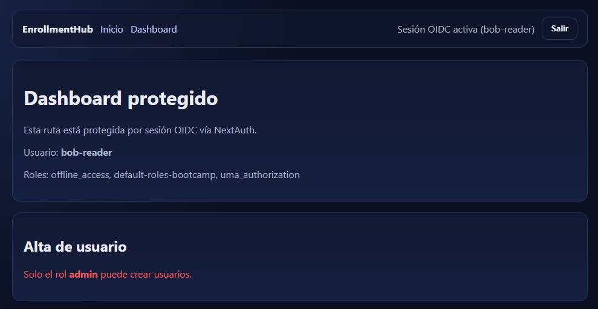

# Evidencias Lab 15 - NextAuth con OIDC

## Objetivo
Integrar autenticación OIDC en Next.js con NextAuth y Keycloak, propagando claims de identidad/roles a sesión, protegiendo rutas y validando acceso por rol.

## Comandos ejecutados

## Prompt inicial del lab

```text
Implementa autenticación OIDC con NextAuth en la app Next del laboratorio, mapea claims en sesión, protege rutas y valida acceso por rol admin en dashboard.
```

## Pasos

### Paso 1: Configurar proveedor OIDC en NextAuth
Se configuró Keycloak como provider OIDC en:
- `templates/next16-app/src/auth.js`

Incluye:
- `issuer`, `clientId`, `clientSecret`
- secret de sesión (`AUTH_SECRET`)
- estrategia JWT para sesión.

Captura sugerida:


### Paso 2: Mapear claims y tokens en callbacks
Se implementaron callbacks en `auth.js` para:
- guardar `accessToken`, `idToken`, `refreshToken` y expiración,
- propagar `preferred_username` a `session.user.username`,
- propagar roles a `session.user.roles`,
- soportar refresh de token cuando expira.

### Paso 3: Implementar pantalla de login OIDC
Se preparó flujo de login en:
- `templates/next16-app/src/app/login/login-form.js`

Acción funcional:
- botón de entrada con proveedor Keycloak mediante NextAuth.

Captura sugerida:


### Paso 4: Proteger rutas y acceso por rol
Se aplicó protección de rutas en middleware/proxy de la app:
- rutas de dashboard requieren sesión,
- ruta admin requiere rol `admin`.

Archivo principal de control:
- `templates/next16-app/src/proxy.js`

Captura sugerida:


### Paso 5: Integrar estado de sesión y logout en layout
Se integró sesión activa en navegación y acción de salida en:
- `templates/next16-app/src/app/layout.js`

### Paso 6: Validación funcional con usuarios de prueba
Pruebas funcionales realizadas:
- Login con `alice-admin` y acceso a funcionalidad admin.
- Login con `bob-reader` y restricción en vistas/acciones admin.

Resultado:
- Control de acceso por rol funcionando según claims OIDC.

Captura sugerida:






## Resultado esperado
- Login OIDC funcional con Keycloak.
- Claims y roles disponibles en sesión de NextAuth.
- Rutas protegidas por autenticación y rol.
- Logout funcional desde UI.

## Resultado obtenido
- ✅ Integración OIDC operativa en NextAuth.
- ✅ Claims/tokens propagados correctamente a sesión.
- ✅ Dashboard protegido y control por rol `admin` funcionando.
- ✅ Flujo login/logout implementado en la app.

## Problemas y solución
1. Problema: roles no visibles de forma consistente en UI.
  - Solución: mapear roles explícitamente en callback `jwt` y exponerlos en callback `session`.

2. Problema: acceso indebido a rutas sensibles.
  - Solución: aplicar validación de sesión y rol en `proxy.js` para rutas de dashboard/admin.

3. Problema: claims no disponibles en componentes protegidos.
  - Solución: centralizar lectura de sesión con `auth()` y usar `session.user.roles` en render/guardas.
