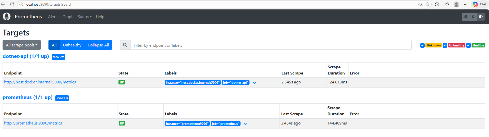
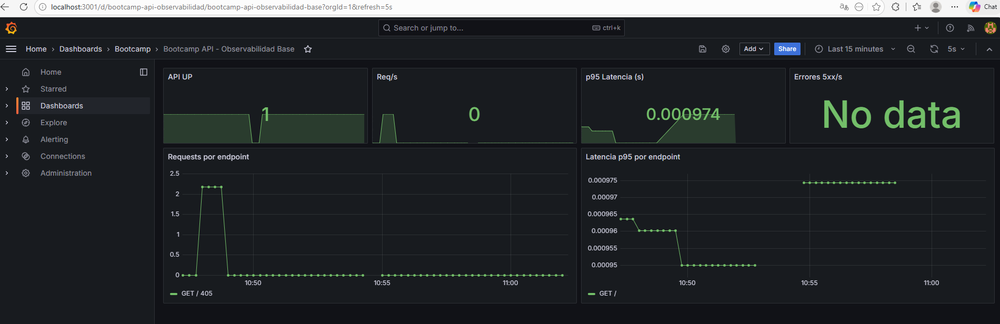
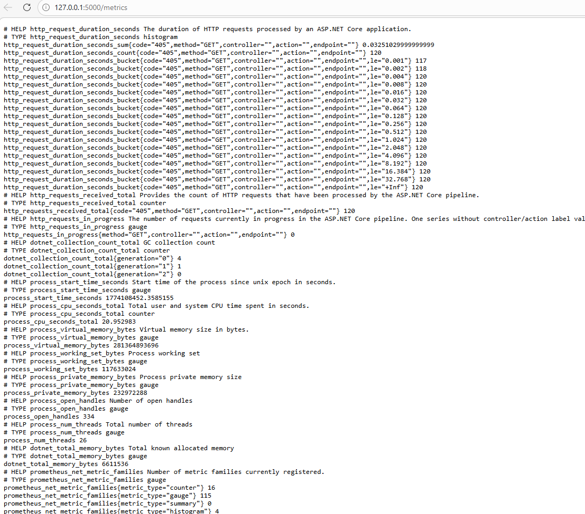
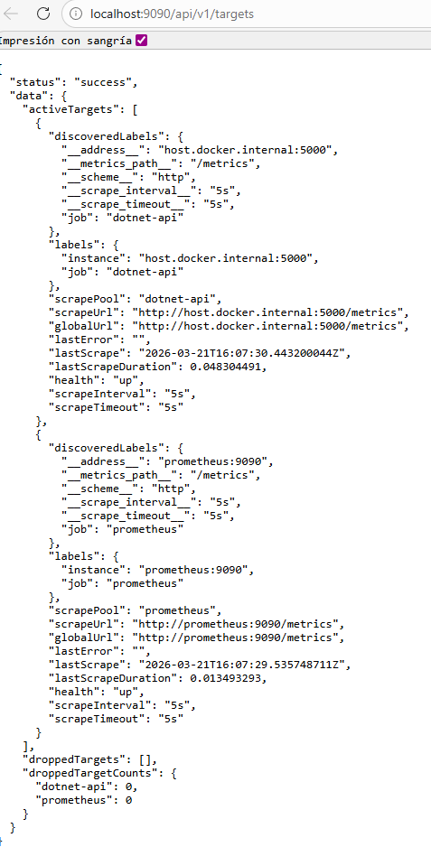
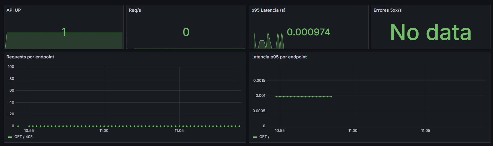

# Evidencias Lab 16 - Observabilidad con Prometheus y Grafana

## Objetivo
Generar visibilidad operativa de la aplicación mediante métricas y dashboards, iniciando con el despliegue del stack de observabilidad del repositorio, exposición de métricas en backend, configuración de scrape targets en Prometheus, creación de dashboard base en Grafana y observación bajo carga.

## Comandos ejecutados

## Prompt inicial del lab

```text
Generame una observabilidad y visibilidad operativa de la aplicación mediante metricas y dashboards, iniciando con el despliegue stack de observabilidad del repositorio, expon metricas desde backend, configura scrape targets en Prometherus, crea dashboard base en Grafana, ejecuta carga y observa el comportamiento.
```

### Paso 1: Desplegar stack de observabilidad del repositorio
Se creó y levantó stack en:
- `observabilidad/prometheus-grafana/docker-compose.yml`

Comando:
```bash
cd observabilidad/prometheus-grafana
docker compose up -d
```

Resultado:
- Prometheus disponible en `http://localhost:9090`

- Grafana disponible en `http://localhost:3001`


### Paso 2: Exponer métricas desde backend (.NET)
Se instrumentó backend en:
- `templates/dotnet10-api/src/Program.cs`
- `templates/dotnet10-api/src/Api.csproj`

Cambios aplicados:
- Paquete `prometheus-net.AspNetCore`
- Middleware `app.UseHttpMetrics()`
- Endpoint `app.MapMetrics("/metrics")`

Comandos:
```bash
cd templates/dotnet10-api/src
dotnet build
ASPNETCORE_URLS=http://0.0.0.0:5000 ASPNETCORE_ENVIRONMENT=Development dotnet run
```

Resultado:
- Métricas accesibles en `http://127.0.0.1:5000/metrics`


### Paso 3: Configurar scrape targets en Prometheus
Archivo configurado:
- `observabilidad/prometheus-grafana/prometheus/prometheus.yml`

Target principal:
- job: `dotnet-api`
- target: `host.docker.internal:5000`
- path: `/metrics`

Validación:
```bash
curl -s http://localhost:9090/api/v1/targets
```

Resultado observado:
- target `dotnet-api` en estado `up`.


### Paso 4: Crear dashboard base en Grafana
Se provisionó automáticamente:
- datasource: `observabilidad/prometheus-grafana/grafana/provisioning/datasources/datasource.yml`
- provider dashboards: `observabilidad/prometheus-grafana/grafana/provisioning/dashboards/dashboard.yml`
- dashboard JSON: `observabilidad/prometheus-grafana/grafana/dashboards/bootcamp-api-observabilidad.json`

Paneles incluidos:
- API UP
- Req/s
- p95 Latencia
- Errores 5xx/s
- Requests por endpoint
- Latencia p95 por endpoint

Validación:
```bash
curl -s -u admin:admin "http://localhost:3001/api/search?query=Bootcamp%20API"
```

Resultado observado:
- Dashboard encontrado: `Bootcamp API - Observabilidad Base`.


### Paso 5: Ejecutar carga y observar comportamiento
Carga aplicada:
- requests repetidas contra `/swagger` y `/api/auth/login`.

Medición observada en Prometheus (muestra real):
- `before = 0`
- `after = 120`
- `delta = 120`
- `p95 ≈ 0.00097 s`

Resultado:
- El contador de requests incrementa bajo carga.
- La latencia p95 se refleja en el dashboard.

## Resultado esperado
- Stack Prometheus/Grafana desplegado desde repositorio.
- Backend exponiendo `/metrics`.
- Target de Prometheus en `up`.
- Dashboard base en Grafana con datos reales.
- Evidencia de comportamiento bajo carga.

## Resultado obtenido
- ✅ Stack desplegado y operativo (`9090`, `3001`).
- ✅ Backend .NET instrumentado y exponiendo métricas.
- ✅ Scrape de Prometheus funcionando sobre `dotnet-api`.
- ✅ Dashboard base provisionado automáticamente en Grafana.
- ✅ Carga ejecutada y métricas observadas (requests y p95).

## Problemas y solución

1. Problema: Prometheus no alcanzaba backend (`connection refused`).
   - Solución: ejecutar API en `0.0.0.0:5000` y scrapear `host.docker.internal:5000`.

2. Problema: parte del tráfico no impactaba métricas HTTP.
   - Solución: mover `UseHttpMetrics()` antes de `UseHttpsRedirection()` en pipeline.
